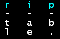

# RipTable


All in one, high performance 64 bit python analytics engine for numpy arrays with multithreaded support.

Support for Python 3.6, 3.7, 3.8 on 64 bit Linux, Windows, and Mac OS.

Enhances or replaces numpy, pandas, and includes high speed cross platform SDS file format.
RipTable can often crunch numbers at 1.5x to 10x the speed of numpy or pandas.  

Maximum speed is achieved through the use of **[vector instrinsics](https://software.intel.com/sites/landingpage/IntrinsicsGuide/)**: hand rolled loops, using [AVX-256](https://en.wikipedia.org/wiki/Advanced_Vector_Extensions#CPUs_with_AVX2)  with [AVX-512](https://en.wikipedia.org/wiki/AVX-512) support coming; **[parallel computing](https://www.drdobbs.com/go-parallel/article/print?articleId=212903586)**: for large arrays, multiple threads are deployed; **[recycling](https://en.wikipedia.org/wiki/Garbage_collection_(computer_science))**: built in array garbage collection; **[hashing](https://en.wikipedia.org/wiki/Hash_function)** and **parallel sorts** for core algorithms.

Install 
-------
```
pip install riptable
```

Documentation: [readthedocs](https://riptable.readthedocs.io/en/latest/py-modindex.html)

Basic Concepts and Classes
--------------------------
**[FastArray](https://riptable.readthedocs.io/en/latest/riptable.html#riptable.rt_fastarray.FastArray)**: subclasses from a numpy array with builtin multithreaded number crunching.  All scikit routines that expect a numpy array will also accept a FastArray since it is subclassed.  isinstance(fastarray, np.ndarray) will return True.

**[Dataset](https://riptable.readthedocs.io/en/latest/riptable.html#module-riptable.rt_dataset)**: replaces the pandas DataFrame class and holds equal row length numpy arrays (including > 1 dimension).

**Struct**: replaces the pandas Series class.  A **Struct** is a grab bag collection class that **Dataset** subclasses from.

**[Categorical](https://riptable.readthedocs.io/en/latest/riptable.html#module-riptable.rt_categorical)**: replaces both pandas groupby and Categorical class.  RipTable **Categoricals** are multikey, filterable, stackable, archivable, and can chain computations such as apply_reduce loops.  They can do everything groupby can plus more.

**Date/Time Classes**: DateTimeNano, Date, TimeSpan, and DateSpan are designed more like Java, C++, or C# classes.  Replaces most numpy and pandas date time classes.

**Accum2/AccumTable**: For cross tabulation.

**[SDS](https://riptable.readthedocs.io/en/latest/riptable.html#riptable.rt_sds.save_sds)**: a new file format which can stack multiple datasets in multiple files with [zstd](https://github.com/facebook/zstd) compression, threads, and no extra memory copies.  SDS also supports loading and writing datasets to shared memory.

Getting Started
----------------
```
import riptable as rt
ds = rt.Dataset({'intarray': rt.arange(1_000_000), 'floatarray': rt.arange(1_000_000.0)})
ds
ds.intarray.sum()
```

Numpy Users
------------
FastArray is a numpy array, however they can be flipped back and forth with no array copies taking place (it just changes the view).
```
import riptable as rt
import numpy as np
a = rt.arange(100)
numpyarray = a._np
fastarray = rt.FA(numpyarray)
```
or directly by changing the view, note how a FastArray is a numpy array
```
numpyarray.view(rt.FastArray)
fastarry.view(np.ndarray)
ininstance(fastarray, np.ndarray)
```

Pandas Users
------------
Simply drop a pandas DataFrame class into a riptable Dataset and it will be auto converted.
```
import riptable as rt
import numpy as np
import pandas as pd
df = pd.DataFrame({'intarray': np.arange(1_000_000), 'floatarray': np.arange(1_000_000.0)})
ds = rt.Dataset(df)
```
How can I contribute?
---------------------
RipTable has been public open sourced because it needs more users and
contributions to take it to the next level.  The RipTable team is confident
the engine is the next generation building block for python data analytics
computing.  We need help from reporting bugs, docs, improved functionality,
and new functionality.  Please consider a github pull request or email the
team.

See the [contributing guide](docs/CONTRIBUTING.md) for more information.

How can I trust RipTable calculations?
--------------------------------------
RipTable has been in development for 3 years and tested by dozens of quants at a large financial firm.  It has a full suite of [testing](riptable/tests).  However just like any project, we still disover bugs and improvements.  Please report them using github issues.

How can RipTable perform the same calculations faster?
------------------------------------------------------
RipTable was written from day one to handle large data and mulithreading using the riptide_cpp layer for basic arithmetic functions and algorithms.  Many core algorithms have been painstakingly rewritten for multithreading.

Why doesn't numpy or pandas just pick up the same code?
-------------------------------------------------------
numpy does not have a multithreaded layer (we are in discussions with the numpy team to add such a layer), nor is it designed to use C++ templates or hashing algorithms.  pandas does not have a C++ layer (it uses cython instead) and is a victim of its own success making early design mistakes difficult to change (such as the block manager and lack of powerful Categoricals).

Small, Medium, and Large array performance
------------------------------------------
RipTable is designed for *all* sizes of arrays.  For small arrays (< 100 length), low processing overhead is important.  RipTable's **FastArray** is written in hand coded 'C' and processes simple arithmetic functions faster than numpy arrays.  For medium arrays (< 100,000 length), RipTable has vector instrinic loops.  For large arrays (>= 100,000) RipTable knows how to dynamically scale out threading, waking up threads efficiently using a [futex](https://man7.org/linux/man-pages/man7/futex.7.html).
