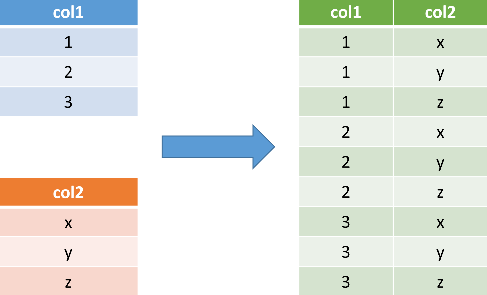

.. currentmodule:: riptable

Get the Cross Join of Two Datasets Using ``merge2()``
*****************************************************

In SQL and other relational database query languages, a cross join of two tables returns 
a table that contains all combinations the two input tables' rows. That is, each row of the
first table is joined with each row of the second table. 

If the first table has ``M`` rows and the second table has ``N`` rows, the resulting table 
has ``M x N`` rows. Because the result has all combinations of the two tables' rows, the 
cross join operation is also called a Cartesian join.

**The key to a merge2 cross join: matching key values**

Although most joins are performed based on matching "key" values in both tables, the 
database cross join doesn't require matching keys -- it simply combines all rows. By
contrast, Riptable's :py:func:`~.rt_merge.merge2` function *does* require matching keys, 
so to perform a cross join using :py:func:`~.rt_merge.merge2` you need to add a column of 
keys to each table in which every key value is the same.

(For more about Riptable's merge operations, see the `Merge Datasets <tutorial_merge.rst>`__ 
section of the `Intro to Riptable <tutorial_intro.rst>`__ or the API reference docs for 
the :py:mod:`.rt_merge` module.)

For example, we have two :py:class:`~.rt_dataset.Dataset` objects, one with dates and one
with times, and we want to create one :py:class:`~.rt_dataset.Dataset` that includes all 
of the DateTime combinations. 

So we want to cross join these two :py:class:`~.rt_dataset.Dataset` objects::

    >>> date_ds = rt.Dataset({"Date": rt.Date(["20220222", "2011111"])})
    >>> time_ds = rt.Dataset({"Time": rt.TimeSpan([9, 10, 11, 12], "h")})

    >>> date_ds
    #         Date
    -   ----------
    0   2022-02-22
    1   2011-11-01

    >>> time_ds
    #                 Time
    -   ------------------
    0   09:00:00.000000000
    1   10:00:00.000000000
    2   11:00:00.000000000
    3   12:00:00.000000000

First, we add a matching key column (called **Key**) to each :py:class:`~.rt_dataset.Dataset`. 
We use floating point ones here because they're easy to generate, but any value that's the 
same in both columns will work.

    >>> date_ds.Key = rt.ones(2)
    >>> date_ds
    #         Date    Key
    -   ----------   ----
    0   2022-02-22   1.00
    1   2011-11-01   1.00

    >>> time_ds.Key = rt.ones(4)
    >>> time_ds
    #                 Time    Key
    -   ------------------   ----
    0   09:00:00.000000000   1.00
    1   10:00:00.000000000   1.00
    2   11:00:00.000000000   1.00
    3   12:00:00.000000000   1.00

We then pass the two :py:class:`~rt_dataset.Dataset` objects to the :py:func:`.rt_merge.merge2` 
function with ``on="Key"`` (this tells :py:func:`~.rt_merge.merge2` to join rows that have 
matching values in the **Key** column)::

    >>> cart_join = rt.merge2(date_ds, time_ds, on="Key")
    >>> cart_join
    #    Key         Date                 Time
    -   ----   ----------   ------------------
    0   1.00   2022-02-22   09:00:00.000000000
    1   1.00   2022-02-22   10:00:00.000000000
    2   1.00   2022-02-22   11:00:00.000000000
    3   1.00   2022-02-22   12:00:00.000000000
    4   1.00   2011-11-01   09:00:00.000000000
    5   1.00   2011-11-01   10:00:00.000000000
    6   1.00   2011-11-01   11:00:00.000000000
    7   1.00   2011-11-01   12:00:00.000000000

Each row in the first :py:class:`~.rt_dataset.Dataset` is joined with the four rows in 
the other :py:class:`~.rt_dataset.Dataset` that have the same key column value. The result 
is a :py:class:`~rt_dataset.Dataset` that has all combinations of the rows.

To remove the **Key** column from the returned :py:class:`~rt_dataset.Dataset`, use 
:py:meth:`.rt_struct.Struct.col_remove`::

    >>> cart_join.col_remove("Key")
    >>> cart_join
    #         Date                 Time
    -   ----------   ------------------
    0   2022-02-22   09:00:00.000000000
    1   2022-02-22   10:00:00.000000000
    2   2022-02-22   11:00:00.000000000
    3   2022-02-22   12:00:00.000000000
    4   2011-11-01   09:00:00.000000000
    5   2011-11-01   10:00:00.000000000
    6   2011-11-01   11:00:00.000000000
    7   2011-11-01   12:00:00.000000000