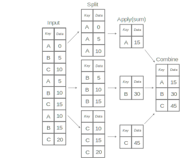

Perform Group Operations with Categoricals
==========================================

Riptable Categoricals have two related uses:

-  They efficiently store string (or other large dtype) arrays that have
   repeated values. The repeated values are partitioned into groups (a.k.a.
   categories), and each group is mapped to an integer. For example, in a 
   Categorical that contains three ‘AAPL’ symbols and four ‘MSFT’ symbols, 
   the data is partitioned into an ‘AAPL’ group that's mapped to 1 and a 
   ‘MSFT’ group that's mapped to 2. This integer mapping allows the data to 
   be stored and operated on more efficiently.
-  They’re Riptable’s class for doing group operations. A method applied
   to a Categorical is applied to each group separately.

We’ll talk about group operations first, then look at how Categoricals
store data under the hood.

Here's a simple Dataset with repeated stock symbols and some values::

    >>> ds = rt.Dataset()
    >>> ds.Symbol = rt.FA(['AAPL', 'MSFT', 'AAPL', 'TSLA', 'MSFT', 'TSLA'])
    >>> ds.Value = rt.FA([5, 10, 15, 20, 25, 30])
    >>> ds
    #   Symbol   Value
    -   ------   -----
    0   AAPL         5
    1   MSFT        10
    2   AAPL        15
    3   TSLA        20
    4   MSFT        25
    5   TSLA        30

Categoricals for Group Operations
---------------------------------

We know how to get the sum of the Value column::

    >>> ds.Value.sum()
    105

Categoricals make it just as easy to get the sum for each symbol.

Use the Categorical constructor to turn the Symbol column into a Categorical::

    >>> ds.Symbol = rt.Categorical(ds.Symbol)  # Note: rt.Cat() also works.

Now we call the ``sum()`` method on the Categorical, passing it the data we want
to sum for each group::

    >>> ds.Symbol.sum(ds.Value)
    *Symbol   Value
    -------   -----
    AAPL         20
    MSFT         35
    TSLA         50

A Dataset is returned containing the groups from the Categorical and the result
of the operation we called on each group. 

Note the prepended '*' in the Symbol column. This indicates that the column 
was used as the grouping variable in an operation.

Categoricals as Split, Apply, Combine Operations
------------------------------------------------

Hadley Wickham, known for his work on Rstats, described the operation
(also known as a “group by” operation) as *split, apply, combine*.

The illustration below shows how the groups are split based on the “keys”
(or, in Riptable’s case, the Categorical values). The sum method is then
applied to each group separately, and the results are combined into an
output array.

Operations Supported by Categoricals
------------------------------------

Categoricals support most common reducing functions, which return one value per
group. Some of the more common ones:

======================== ============================
**Reducing Function**    **Description**
======================== ============================
``count()``              Total number of items
``first()``, ``last()``  First item, last item
``mean()``, ``median()`` Mean, median
``min()``, ``max()``     Minimum, maximum
``std()``, ``var()``     Standard deviation, variance
``prod()``               Product of all items
``sum()``                Sum of all items
======================== ============================

Here’s the `complete list of Categorical reducing
functions <tutorial_cat_reduce.rst>`__.

Categoricals also support non-reducing functions. But because non-reducing
functions return one value for each value in the original data, the results
are a little different.

For example, take ``cumsum()``, which is a running total.

When it’s applied to a Categorical, the function does get applied to
each group separately. However, the returned Dataset has one result per value 
of the original data::

    >>> ds.Value2 = rt.FA([2, 10, 5, 25, 8, 20])
    >>> ds.Symbol.cumsum(ds.Value2)
    #   Value2
    -   ------
    0        2
    1       10
    2        7
    3       25
    4       18
    5       45

The alignment of the result to the original data is easier to see if you add 
the results to the Dataset::

    >>> ds.CumValue2 = ds.Symbol.cumsum(ds.Value2)
    >>> # Sort to make the cumulative sum per group more clear, then display only the relevant columns.
    >>> ds.sort_copy('Symbol').col_filter(['Symbol', 'Value2', 'CumValue2'])
    #   Symbol   Value2   CumValue2
    -   ------   ------   ---------
    0   AAPL          2           2
    1   AAPL          5           7
    2   MSFT         10          10
    3   MSFT          8          18
    4   TSLA         25          25
    5   TSLA         20          45

A commonly used non-reducing function is ``shift()``. You can use it to
compare values with shifted versions of themselves – for example,
today’s price compared to yesterday’s price, the volume compared to the
volume an hour ago, etc.

Where a category has no previous value to shift forward, the missing
value is filled with an invalid value (e.g., ``Inv`` for integers or 
``nan`` for floats)::

    >>> ds.PrevValue = ds.Symbol.shift(ds.Value)
    >>> ds.col_filter(['Symbol', 'Value', 'PrevValue'])
    #   Symbol   Value   PrevValue
    -   ------   -----   ---------
    0   AAPL         5         Inv
    1   MSFT        10         Inv
    2   AAPL        15           5
    3   TSLA        20         Inv
    4   MSFT        25          10
    5   TSLA        30          20

Other non-reducing functions include ``rolling_sum()``,
``rolling_mean()`` and their nan-versions ``rolling_nansum()`` and
``rolling_nanmean()``, and ``cumsum()`` and ``cumprod()``.

Other functions not listed here can also be applied to Categoricals,
including lambda functions and other user-defined functions, with the
help of ``apply()``. More on that below. 

Expand the Results of Reducing Operations with ``transform``
------------------------------------------------------------

Notice that if we try to add the result of a *reducing* operation to a
Dataset, Riptable complains that the result isn’t the right length::

    >>> try:
    ...     ds.Mean = ds.Symbol.mean(ds.Value)
    ... except TypeError as e:
    ...     print("TypeError:", e)
    TypeError: ('Row mismatch in Dataset._check_addtype.  Tried to add Dataset of different lengths', 6, 3)

You can expand the result of a reducing function so that it’s aligned
with the original data by passing ``transform=True`` to the function::

    >>> ds.MaxValue = ds.Symbol.max(ds.Value, transform=True)
    >>> ds.sort_copy(['Symbol', 'Value']).col_filter(['Symbol', 'Value', 'MaxValue'])
    #   Symbol   Value   MaxValue
    -   ------   -----   --------
    0   AAPL         5         15
    1   AAPL        15         15
    2   MSFT        10         25
    3   MSFT        25         25
    4   TSLA        20         30
    5   TSLA        30         30

The max value per symbol is repeated for every instance of the symbol.

Apply an Operation to Multiple Columns or a Dataset
---------------------------------------------------

You can apply a function to multiple columns by passing a list of column
names. Here's a reducing function applied to two columns::

    >>> ds.Value3 = ds.Value * 2  # Add another column of data.
    >>> ds.Symbol.max([ds.Value, ds.Value3])
    *Symbol   Value   Value3
    -------   -----   ------
    AAPL         15       30
    MSFT         25       50
    TSLA         30       60

Note the syntax for adding the results of an operation on two columns to a 
Dataset. To be the right length for the Dataset, the results have to be from 
a non-reducing function or a reducing function that has ``transform=True``::

    >>> ds[['MaxValue', 'MaxValue3']] = ds.Symbol.max([ds.Value, ds.Value3], 
    ...                                               transform=True)[['Value', 'Value3']]
    #   Symbol   Value   Value3   MaxValue   MaxValue3
    -   ------   -----   ------   --------   ---------
    0   AAPL         5       10         15          30
    1   AAPL        15       30         15          30
    2   MSFT        10       20         25          50
    3   MSFT        25       50         25          50
    4   TSLA        20       40         30          60
    5   TSLA        30       60         30          60

You can also apply a function to a whole Dataset. Any column for which the 
function fails – for example, a numerical function on a string column – is 
not returned::

    >>> ds.OptionType = list("PC")*3  # Add a string column.
    >>> ds.Symbol.max(ds)
    *Symbol   Value   CumValue   Value3   MaxValue   MaxValue3
    -------   -----   --------   ------   --------   ---------
    AAPL         15         20       30         15          30
    MSFT         25         35       50         25          50
    TSLA         30         50       60         30          60

Categoricals for Storing Strings
--------------------------------

To get a better sense of how Categoricals store data, let’s look at one
under the hood::

    >>> ds.Symbol
    Categorical([AAPL, MSFT, AAPL, TSLA, MSFT, TSLA]) Length: 6
      FastArray([1, 2, 1, 3, 2, 3], dtype=int8) Base Index: 1
      FastArray([b'AAPL', b'MSFT', b'TSLA'], dtype='|S4') Unique count: 3

The first line shows the 6 symbols. You can access the array with
``expand_array``::

    >>> ds.Symbol.expand_array
    FastArray([b'AAPL', b'MSFT', b'AAPL', b'TSLA', b'MSFT', b'TSLA'], 
              dtype='|S8')

The second line is a FastArray of integers, with one integer for each unique 
category of the Categorical. It's accessible with ``_fa``::

    >>> ds.Symbol._fa
    FastArray([1, 2, 1, 3, 2, 3], dtype=int8)

The list of unique categories is shown in the third line. You can access the
list with ``category_array``::

    >>> ds.Symbol.category_array
    FastArray([b'AAPL', b'MSFT', b'TSLA'], dtype='|S4')

It’s the same thing we get if we do::

    >>> ds.Symbol.unique()
    FastArray([b'AAPL', b'MSFT', b'TSLA'], dtype='|S4')

We can get a better picture of the mapping by putting the integer
FastArray into the Dataset::

    >>> ds.Mapping = ds.Symbol._fa
    >>> ds.col_filter(['Symbol', 'Mapping'])
    #   Symbol   Mapping
    -   ------   -------
    0   AAPL           1
    1   MSFT           2
    2   AAPL           1
    3   TSLA           3
    4   MSFT           2
    5   TSLA           3

Because it’s much more efficient to pass around integers than it is to
pass around strings, it’s common for string data with repeated values to
be stored using integer mapping.

If you have data stored as integers (for example, datetime data), you can create 
a Categorical using the integer array and an array of unique categories::

    >>> c = rt.Categorical([1, 3, 2, 2, 1, 3, 3, 1], categories=['a','b','c'])
    >>> c
    Categorical([a, c, b, b, a, c, c, a]) Length: 8
      FastArray([1, 3, 2, 2, 1, 3, 3, 1]) Base Index: 1
      FastArray([b'a', b'b', b'c'], dtype='|S1') Unique count: 3

Notice that in this Categorical and the one we created above, the base
index is 1, not 0. 

This brings us to an important note about Categoricals: By default, the base 
index is 1; 0 is reserved for holding any values of the Categorical that are
filtered out of operations on the Categorical.

Values can be filtered out of all operations or specific ones.

Filter Values or Categories from All Categorical Operations
-----------------------------------------------------------

When you create a Categorical, you can filter certain values or entire 
categories from all operations on it. 

We'll start with filtering values. Say we have a Dataset with symbols 'A' and
'B' that are associated with exchanges 'X', 'Y', and 'Z'.

    >>> # Create the Dataset.
    >>> rng = np.random.default_rng(seed=42)
    >>> N = 25
    >>> symbol_exchange = rt.Dataset()
    >>> symbol_exchange.Symbol = rt.FA(rng.choice(['A', 'B'], N))
    >>> symbol_exchange.Exchange = rt.FA(rng.choice(['X', 'Y', 'Z'], N))
    >>> symbol_exchange
     #   Symbol   Exchange
    --   ------   --------
     0   B        Y       
     1   A        X       
     2   B        Z       
     3   A        Y       
     4   B        Y       
     5   B        Y       
     6   B        Y       
     7   B        X       
     8   A        Y       
     9   B        Z       
    10   A        X       
    11   B        Y       
    12   B        X       
    13   A        Y       
    14   B        Y       
    15   B        Z       
    16   A        X       
    17   A        X       
    18   A        Y       
    19   A        Z       
    20   A        Z       
    21   B        X       
    22   B        X       
    23   A        Z       
    24   B        X     

We want to make the Symbol column a Categorical, but we're interested in only
the symbol values that are associated with the 'X' exchange.

When we create the Categorical, we can use the ``filter`` keyword argument with
a Boolean mask array that's True for symbol values associated with the 'X' 
exchange::

    >>> exchangeX = symbol_exchange.Exchange == 'X'  # Create a mask array.
    >>> c_x = rt.Cat(symbol_exchange.Symbol, filter=exchangeX)

When we view the Categorical, we can see that symbol values associated with 
exchanges 'Y' and 'Z' are shown as 'Filtered', and the 'Filtered' values are
mapped to the 0 index in the integer array::

    >>> c_x
    Categorical([Filtered, A, Filtered, Filtered, Filtered, ..., Filtered, B, B, Filtered, B]) Length: 25
      FastArray([0, 1, 0, 0, 0, ..., 0, 2, 2, 0, 2], dtype=int8) Base Index: 1
      FastArray([b'A', b'B'], dtype='|S1') Unique count: 2

To better see what's filtered, we can add it to the Dataset::

    >>> symbol_exchange.Filtered = c_x
     #   Symbol   Exchange   Filtered
    --   ------   --------   --------
     0   B        Y          Filtered
     1   A        X          A       
     2   B        Z          Filtered
     3   A        Y          Filtered
     4   B        Y          Filtered
     5   B        Y          Filtered
     6   B        Y          Filtered
     7   B        X          B       
     8   A        Y          Filtered
     9   B        Z          Filtered
    10   A        X          A       
    11   B        Y          Filtered
    12   B        X          B       
    13   A        Y          Filtered
    14   B        Y          Filtered
    15   B        Z          Filtered
    16   A        X          A       
    17   A        X          A       
    18   A        Y          Filtered
    19   A        Z          Filtered
    20   A        Z          Filtered
    21   B        X          B       
    22   B        X          B       
    23   A        Z          Filtered
    24   B        X          B      

Now, a group operation applied to the Categorical omits the filtered
values::

    >>> c_x.count()
    *Symbol   Count
    -------   -----
    A             4
    B             5

Filtering out an entire category (here, the 'A' symbol) is similar::

    >>> f_A = symbol_exchange.Symbol != 'A'
    >>> c_b = rt.Categorical(symbol_exchange.Symbol, filter=f_A)
    >>> c_b
    Categorical([B, Filtered, B, Filtered, B, ..., Filtered, B, B, Filtered, B]) Length: 25
      FastArray([1, 0, 1, 0, 1, ..., 0, 1, 1, 0, 1], dtype=int8) Base Index: 1
      FastArray([b'B'], dtype='|S1') Unique count: 1

The filtered category is entirely omitted from operations::

    >>> c_b.count()
    *Symbol   Count
    -------   -----
    B            14

If you're creating a Categorical from integers and provided categories, another 
way to filter a category is to map it to 0. 

Because 0 is reserved for the Filtered category, here 'a' is mapped to 1 and 'b' is 
mapped to 2. And because there's no 3 to map to 'c', 'c' becomes Filtered::

    >>> c1 = rt.Categorical([0, 2, 1, 1, 0, 2, 2, 0], categories=['a','b','c'])
    >>> c1
    Categorical([Filtered, b, a, a, Filtered, b, b, Filtered]) Length: 8
      FastArray([0, 2, 1, 1, 0, 2, 2, 0]) Base Index: 1
      FastArray([b'a', b'b', b'c'], dtype='|S1') Unique count: 3

In this case, the filtered category appears in the result, but it's still 
omitted from calculations on the Categorical::

    >>> c1.count()
    *key_0   Count
    ------   -----
    a            2
    b            3
    c            0

Note that the first column in the output is labeled 'key_0'. This was code-generated because there was no explicit column name declaration. 
You can use the :meth:`.FastArray.set_name` method to assign a column name to the Categorical before doing any grouping operations.
The Count column was created by the ``count()`` method.

Filter Values or Categories from Certain Categorical Operations
---------------------------------------------------------------

It’s also possible to filter values for only a certain operation.

In `Get and Operate on Subsets of Data Using Filters <tutorial_filters.rst>`__, 
we saw that many operations called on FastArrays / Dataset columns take a 
``filter`` keyword argument that limits the data operated on::

    >>> a = rt.FA([1, 2, 3, 4, 5])
    >>> a.mean(filter=a > 2)
    4.0

It's similar with Categoricals:: 

    >>> Symbol = rt.Cat(rt.FA(['AAPL', 'MSFT', 'AAPL', 'TSLA', 'MSFT', 'TSLA']))
    >>> Value = rt.FA([5, 10, 15, 20, 25, 30])
    >>> Symbol.mean(Value, filter=Value > 20.0)
    *key_0   col_0
    ------   -----
    AAPL       nan
    MSFT     25.00
    TSLA     30.00

The data that doesn’t meet the condition is omitted from the computation
for only that operation.

To filter out an entire category::

    >>> ds.Symbol.mean(ds.Value, filter=ds.Symbol != 'MSFT')
    *Symbol   Value
    -------   -----
    AAPL      10.00
    MSFT        nan
    TSLA      25.00

In this case, the filtered category is shown, but the result of the operation
on its values is NaN.

If you want to make sure your filter is doing what you intend before you 
apply a function to the filtered data, you can call ``set_valid()`` on the
Categorical.

Calling ``set_valid()`` on a Categorical returns a Categorical of the
same length in which everywhere the filter result is False, the category
gets set to ‘Filtered’ and the associated index value is 0. This is in
contrast to filtered Datasets, where ``filter()`` returns a smaller
Dataset, reduced to only the rows where the filter result is True (where
the filter condition is met).

    >>> Symbol.set_valid(ds.Value > 20.0)
    Categorical([Filtered, Filtered, Filtered, Filtered, MSFT, TSLA]) Length: 6
      FastArray([0, 0, 0, 0, 1, 2], dtype=int8) Base Index: 1
      FastArray([b'MSFT', b'TSLA'], dtype='|S4') Unique count: 2

To more closely spot-check, put the filtered values in a Dataset::

    >>> ds_test = rt.Dataset()
    >>> ds_test.SymbolTest = ds.Symbol.set_valid(ds.Value > 20.0)
    >>> ds_test.ValueTest = ds.Value
    >>> ds_test
    #   SymbolTest   ValueTest
    -   ----------   ---------
    0   Filtered             5
    1   Filtered            10
    2   Filtered            15
    3   Filtered            20
    4   MSFT                25
    5   TSLA                30

The advice to avoid making unnecessary copies of large amounts of data
using ``set_valid()`` also applies to Categoricals.

Multi-Key Categoricals
----------------------

Multi-key Categoricals let you create and operate on groupings based on
two related categories.

An example is a symbol-month pair, which you could use to get the
average value of a stock for each month in your data::

    >>> ds_mk = rt.Dataset()
    >>> N = 25
    >>> ds_mk.Symbol = rt.FA(rng.choice(['AAPL', 'AMZN', 'MSFT'], N))
    >>> ds_mk.Value = rt.FA(rng.random(N))
    >>> ds_mk.Date = rt.Date.range('20210101', '20211231', step=15)
    >>> ds_mk
     #   Symbol   Value         Date
    --   ------   -----   ----------
     0   AAPL      0.59   2021-01-01
     1   MSFT      0.78   2021-01-16
     2   AAPL      0.80   2021-01-31
     3   AAPL      0.95   2021-02-15
     4   AMZN      0.25   2021-03-02
     5   MSFT      0.59   2021-03-17
     6   AMZN      0.10   2021-04-01
     7   MSFT      0.62   2021-04-16
     8   MSFT      0.17   2021-05-01
     9   AAPL      0.56   2021-05-16
    10   MSFT      0.57   2021-05-31
    11   AMZN      0.47   2021-06-15
    12   AMZN      0.52   2021-06-30
    13   AAPL      0.76   2021-07-15
    14   AMZN      0.80   2021-07-30
    15   MSFT      0.49   2021-08-14
    16   AMZN      0.60   2021-08-29
    17   AAPL      0.93   2021-09-13
    18   AMZN      0.12   2021-09-28
    19   MSFT      0.12   2021-10-13
    20   MSFT      0.09   2021-10-28
    21   AAPL      0.66   2021-11-12
    22   MSFT      0.42   2021-11-27
    23   MSFT      0.77   2021-12-12
    24   AAPL      0.67   2021-12-27

We want to group the dates by month. An easy way to do this is by using
``start_of_month``::

    >>> ds_mk.Month = ds_mk.Date.start_of_month
    >>> ds_mk
    #   Symbol   Value         Date        Month
    --   ------   -----   ----------   ----------
     0   AAPL      0.59   2021-01-01   2021-01-01
     1   MSFT      0.78   2021-01-16   2021-01-01
     2   AAPL      0.80   2021-01-31   2021-01-01
     3   AAPL      0.95   2021-02-15   2021-02-01
     4   AMZN      0.25   2021-03-02   2021-03-01
     5   MSFT      0.59   2021-03-17   2021-03-01
     6   AMZN      0.10   2021-04-01   2021-04-01
     7   MSFT      0.62   2021-04-16   2021-04-01
     8   MSFT      0.17   2021-05-01   2021-05-01
     9   AAPL      0.56   2021-05-16   2021-05-01
    10   MSFT      0.57   2021-05-31   2021-05-01
    11   AMZN      0.47   2021-06-15   2021-06-01
    12   AMZN      0.52   2021-06-30   2021-06-01
    13   AAPL      0.76   2021-07-15   2021-07-01
    14   AMZN      0.80   2021-07-30   2021-07-01
    15   MSFT      0.49   2021-08-14   2021-08-01
    16   AMZN      0.60   2021-08-29   2021-08-01
    17   AAPL      0.93   2021-09-13   2021-09-01
    18   AMZN      0.12   2021-09-28   2021-09-01
    19   MSFT      0.12   2021-10-13   2021-10-01
    20   MSFT      0.09   2021-10-28   2021-10-01
    21   AAPL      0.66   2021-11-12   2021-11-01
    22   MSFT      0.42   2021-11-27   2021-11-01
    23   MSFT      0.77   2021-12-12   2021-12-01
    24   AAPL      0.67   2021-12-27   2021-12-01

Now all Dates in January are associated to 2021-01-01, all Dates in
February are associated to 2021-02-01, etc. These firsts of the month
are our month groups.

We create a multi-key Categorical by passing ``rt.Cat()`` the Symbol
and Month columns::

    >>> ds_mk.Symbol_Month = rt.Cat([ds_mk.Symbol, ds_mk.Month])
    >>> ds_mk.Symbol_Month
    Categorical([(AAPL, 2021-01-01), (MSFT, 2021-01-01), (AAPL, 2021-01-01), (AAPL, 2021-02-01), (AMZN, 2021-03-01), ..., (MSFT, 2021-10-01), (AAPL, 2021-11-01), (MSFT, 2021-11-01), (MSFT, 2021-12-01), (AAPL, 2021-12-01)]) Length: 25
      FastArray([ 1,  2,  1,  3,  4, ..., 17, 18, 19, 20, 21], dtype=int8) Base Index: 1
      {'Symbol': FastArray([b'AAPL', b'MSFT', b'AAPL', b'AMZN', b'MSFT', ..., b'MSFT', b'AAPL', b'MSFT', b'MSFT', b'AAPL'], dtype='|S4'), 'Month': Date(['2021-01-01', '2021-01-01', '2021-02-01', '2021-03-01', '2021-03-01', ..., '2021-10-01', '2021-11-01', '2021-11-01', '2021-12-01', '2021-12-01'])} Unique count: 21

And now we can get the average value for each symbol-month pair::

    >>> ds_mk.Symbol_Month.mean(ds_mk.Value)
    *Symbol       *Month   Value
    -------   ----------   -----
    AAPL      2021-01-01    0.69
    MSFT      2021-01-01    0.78
    AAPL      2021-02-01    0.95
    AMZN      2021-03-01    0.25
    MSFT      2021-03-01    0.59
    AMZN      2021-04-01    0.10
    MSFT      2021-04-01    0.62
    .         2021-05-01    0.37
    AAPL      2021-05-01    0.56
    AMZN      2021-06-01    0.49
    AAPL      2021-07-01    0.76
    AMZN      2021-07-01    0.80
    MSFT      2021-08-01    0.49
    AMZN      2021-08-01    0.60
    AAPL      2021-09-01    0.93
    AMZN      2021-09-01    0.12
    MSFT      2021-10-01    0.10
    AAPL      2021-11-01    0.66
    MSFT      2021-11-01    0.42
    .         2021-12-01    0.77
    AAPL      2021-12-01    0.67

The aggregated results are presented with the two group keys arranged
hierarchically. The dot indicates that the category above is repeated.

All the functions supported by Categoricals can also be used for multi-key 
Categoricals.

You can also filter multi-key Categoricals by calling ``set_valid()`` on
the Categorical, and operate on filtered data by passing the filter
keyword argument to the function you use.

Later on we’ll cover another Riptable function, ``Accum2()``, that
aggregates two groups similarly but provides summary data and a styled 
output.

Partition Numeric Data into Bins for Analysis
---------------------------------------------

When you have a large array of numeric data, ``rt.cut()`` and ``rt.qcut()``
can help you partition the values into Categorical bins for analysis.

Use ``cut()`` to create equal-width bins or bins defined by specified endpoints. 
Use ``qcut()`` to create bins based on sample quantiles.

Let’s use a moderately large Dataset::

    >>> N = 1_000
    >>> ds2 = rt.Dataset()
    >>> ds2.Symbol = rt.FA(rng.choice(['AAPL', 'AMZN', 'MSFT'], N))
    >>> base_price = 100 + rt.FA(np.linspace(0, 900, N))
    >>> noise = rt.FA(rng.normal(0, 50, N))
    >>> ds2.Price = base_price + noise
    >>> ds2
      #   Symbol      Price
    ---   ------   --------
      0   AMZN        93.87
      1   AMZN       150.69
      2   AAPL       154.76
      3   MSFT       153.99
      4   AMZN       105.55
      5   AMZN        62.25
      6   MSFT        51.22
      7   AMZN       123.54
      8   AAPL       126.17
      9   AAPL       172.47
     10   AAPL       164.01
     11   MSFT       103.30
     12   AAPL        48.60
     13   AAPL        95.76
     14   AMZN       123.47
    ...   ...           ...
    985   AMZN     1,027.85
    986   AAPL       993.06
    987   AMZN       867.37
    988   AAPL       940.92
    989   AAPL     1,025.38
    990   MSFT     1,052.54
    991   AAPL     1,048.25
    992   AMZN       914.09
    993   AMZN     1,009.67
    994   AAPL     1,046.27
    995   AAPL       913.48
    996   AMZN       996.90
    997   AMZN     1,011.89
    998   MSFT       984.06
    999   MSFT       907.39

Create equal-width bins with ``rt.cut()``
^^^^^^^^^^^^^^^^^^^^^^^^^^^^^^^^^^^^^^^^^

To partition values into equal-width bins, use ``cut()`` and specify the number 
of bins::

    >>> ds2.PriceBin = rt.cut(ds2.Price, bins=5)
    >>> ds2
      #   Symbol      Price   PriceBin      
    ---   ------   --------   -----------------
      0   AMZN        93.87   -3.011->221.182  
      1   AMZN       150.69   -3.011->221.182  
      2   AAPL       154.76   -3.011->221.182  
      3   MSFT       153.99   -3.011->221.182  
      4   AMZN       105.55   -3.011->221.182  
      5   AMZN        62.25   -3.011->221.182  
      6   MSFT        51.22   -3.011->221.182  
      7   AMZN       123.54   -3.011->221.182  
      8   AAPL       126.17   -3.011->221.182  
      9   AAPL       172.47   -3.011->221.182  
      10  AAPL       164.01   -3.011->221.182  
      11  MSFT       103.30   -3.011->221.182  
      12  AAPL        48.60   -3.011->221.182  
      13  AAPL        95.76   -3.011->221.182  
      14  AMZN       123.47   -3.011->221.182  
     ...   ...          ...   ...              
     985  AMZN     1,027.85   893.763->1117.956
     986  AAPL       993.06   893.763->1117.956
     987  AMZN       867.37   669.569->893.763 
     988  AAPL       940.92   893.763->1117.956
     989  AAPL     1,025.38   893.763->1117.956
     990  MSFT     1,052.54   893.763->1117.956
     991  AAPL     1,048.25   893.763->1117.956
     992  AMZN       914.09   893.763->1117.956
     993  AMZN     1,009.67   893.763->1117.956
     994  AAPL     1,046.27   893.763->1117.956
     995  AAPL       913.48   893.763->1117.956
     996  AMZN       996.90   893.763->1117.956
     997  AMZN     1,011.89   893.763->1117.956
     998  MSFT       984.06   893.763->1117.956
     999  MSFT       907.39   893.763->1117.956

Notice that the bins form the categories of a Categorical::

    >>> ds2.PriceBin
    Categorical([-3.011->221.182, -3.011->221.182, -3.011->221.182, -3.011->221.182, -3.011->221.182, ..., 893.763->1117.956, 893.763->1117.956, 893.763->1117.956, 893.763->1117.956, 893.763->1117.956]) Length: 1000
      FastArray([1, 1, 1, 1, 1, ..., 5, 5, 5, 5, 5], dtype=int8) Base Index: 1
      FastArray([b'-3.011->221.182', b'221.182->445.376', b'445.376->669.569', b'669.569->893.763', b'893.763->1117.956'], dtype='|S17') Unique count: 5

To specify your own bin endpoints, provide an array. Here, we define two
bins: one for prices from 0 to 600 (with both endpoints, 0 and 600, included), 
and one for prices from 600 to 1,200 (600 excluded, 1,200 included)::

    >>> bins = [0, 600, 1200]
    >>> ds2.PriceBin2 = rt.cut(ds2.Price, bins)
    >>> ds2
      #   Symbol      Price   PriceBin            PriceBin2 
    ---   ------   --------   -----------------   -------------
      0   AMZN        93.87   -3.011->221.182     0.0->600.0   
      1   AMZN       150.69   -3.011->221.182     0.0->600.0   
      2   AAPL       154.76   -3.011->221.182     0.0->600.0   
      3   MSFT       153.99   -3.011->221.182     0.0->600.0   
      4   AMZN       105.55   -3.011->221.182     0.0->600.0   
      5   AMZN        62.25   -3.011->221.182     0.0->600.0   
      6   MSFT        51.22   -3.011->221.182     0.0->600.0   
      7   AMZN       123.54   -3.011->221.182     0.0->600.0   
      8   AAPL       126.17   -3.011->221.182     0.0->600.0   
      9   AAPL       172.47   -3.011->221.182     0.0->600.0   
     10   AAPL       164.01   -3.011->221.182     0.0->600.0   
     11   MSFT       103.30   -3.011->221.182     0.0->600.0   
     12   AAPL        48.60   -3.011->221.182     0.0->600.0   
     13   AAPL        95.76   -3.011->221.182     0.0->600.0   
     14   AMZN       123.47   -3.011->221.182     0.0->600.0   
    ...   ...           ...   ...                 ...          
    985   AMZN     1,027.85   893.763->1117.956   600.0->1200.0
    986   AAPL       993.06   893.763->1117.956   600.0->1200.0
    987   AMZN       867.37   669.569->893.763    600.0->1200.0
    988   AAPL       940.92   893.763->1117.956   600.0->1200.0
    989   AAPL     1,025.38   893.763->1117.956   600.0->1200.0
    990   MSFT     1,052.54   893.763->1117.956   600.0->1200.0
    991   AAPL     1,048.25   893.763->1117.956   600.0->1200.0
    992   AMZN       914.09   893.763->1117.956   600.0->1200.0
    993   AMZN     1,009.67   893.763->1117.956   600.0->1200.0
    994   AAPL     1,046.27   893.763->1117.956   600.0->1200.0
    995   AAPL       913.48   893.763->1117.956   600.0->1200.0
    996   AMZN       996.90   893.763->1117.956   600.0->1200.0
    997   AMZN     1,011.89   893.763->1117.956   600.0->1200.0
    998   MSFT       984.06   893.763->1117.956   600.0->1200.0
    999   MSFT       907.39   893.763->1117.956   600.0->1200.0

Create bins based on sample quantiles with ``rt.qcut()``
^^^^^^^^^^^^^^^^^^^^^^^^^^^^^^^^^^^^^^^^^^^^^^^^^^^^^^^^

To partition values into bins based on sample quantiles, use ``qcut()``.

We’ll create another Dataset with symbol groups and contracts per day::

    >>> N = 1_000
    >>> ds3 = rt.Dataset()
    >>> ds3.SymbolGroup = rt.FA(rng.choice(['spx', 'eqt_comp', 'eqt300', 'eqtrest'], N))
    >>> ds3.ContractsPerDay = rng.integers(low=0, high=5_000, size=N)
    >>> ds3.head()
     #   SymbolGroup   ContractsPerDay
    --   -----------   ---------------
     0   eqt300                  1,624
     1   spx                       851
     2   spx                     3,487
     3   eqt300                    345
     4   eqtrest                 2,584
     5   spx                     3,639
     6   spx                     4,741
     7   eqtrest                 1,440
     8   eqtrest                    39
     9   spx                     3,618
    10   eqt_comp                    7
    11   eqt300                    331
    12   spx                     4,952
    13   eqt_comp                4,312
    14   eqt_comp                3,537
    15   eqt300                  4,177
    16   eqt_comp                  376
    17   eqt_comp                  444
    18   eqt_comp                1,504
    19   eqtrest                   118

Create three labeled, quantile-based bins for the volume::

    >>> label_names = ['Low', 'Medium', 'High']
    >>> ds3.Volume = rt.qcut(ds3.ContractsPerDay, q=3, labels=label_names)
    >>> ds3.head()
     #   SymbolGroup   ContractsPerDay   Volume
    --   -----------   ---------------   ------
     0   eqt300                  1,624   Low   
     1   spx                       851   Low   
     2   spx                     3,487   High  
     3   eqt300                    345   Low   
     4   eqtrest                 2,584   Medium
     5   spx                     3,639   High  
     6   spx                     4,741   High  
     7   eqtrest                 1,440   Low   
     8   eqtrest                    39   Low   
     9   spx                     3,618   High  
    10   eqt_comp                    7   Low   
    11   eqt300                    331   Low   
    12   spx                     4,952   High  
    13   eqt_comp                4,312   High  
    14   eqt_comp                3,537   High  
    15   eqt300                  4,177   High  
    16   eqt_comp                  376   Low   
    17   eqt_comp                  444   Low   
    18   eqt_comp                1,504   Low   
    19   eqtrest                   118   Low  

As with ``cut()``, the bins form the categories of a Categorical::

    >>> ds3.Volume
    Categorical([High, High, Medium, High, Low, ..., Low, Medium, High, Low, Low]) Length: 1000
      FastArray([4, 4, 3, 4, 2, ..., 2, 3, 4, 2, 2], dtype=int8) Base Index: 1
      FastArray([b'Clipped', b'Low', b'Medium', b'High'], dtype='|S7') Unique count: 4

The 'Clipped' bin is created to hold any out-of-bounds values (though there are
none in this case).

Alternatively, you can give ``qcut()`` a list of quantiles (numbers
between 0 and 1, inclusive). Here, we create quartiles::

    >>> quartiles = [0, .25, .5, .75, 1.]
    >>> ds3.VolQuartiles = rt.qcut(ds3.ContractsPerDay, q=quartiles)
    >>> ds3.head()
     #   SymbolGroup   ContractsPerDay   Volume   VolQuartiles   
    --   -----------   ---------------   ------   ---------------
     0   eqt300                  1,624   Low      1273.75->2601.0
     1   spx                       851   Low      0.0->1273.75   
     2   spx                     3,487   High     2601.0->3793.0 
     3   eqt300                    345   Low      0.0->1273.75   
     4   eqtrest                 2,584   Medium   1273.75->2601.0
     5   spx                     3,639   High     2601.0->3793.0 
     6   spx                     4,741   High     3793.0->4991.0 
     7   eqtrest                 1,440   Low      1273.75->2601.0
     8   eqtrest                    39   Low      0.0->1273.75   
     9   spx                     3,618   High     2601.0->3793.0 
    10   eqt_comp                    7   Low      0.0->1273.75   
    11   eqt300                    331   Low      0.0->1273.75   
    12   spx                     4,952   High     3793.0->4991.0 
    13   eqt_comp                4,312   High     3793.0->4991.0 
    14   eqt_comp                3,537   High     2601.0->3793.0 
    15   eqt300                  4,177   High     3793.0->4991.0 
    16   eqt_comp                  376   Low      0.0->1273.75   
    17   eqt_comp                  444   Low      0.0->1273.75   
    18   eqt_comp                1,504   Low      1273.75->2601.0
    19   eqtrest                   118   Low      0.0->1273.75  

Per-Group Calculations with Other Functions
-------------------------------------------

Categoricals support most common functions. For functions that aren’t
supported (for example, a function you’ve written), you can use
``apply_reduce()`` to apply a reducing function and
``apply_nonreduce()`` to apply a non-reducing function.

``apply_reduce()``
^^^^^^^^^^^^^^^^^^

The function you use with ``apply_reduce()`` can take in one or multiple
columns/FastArrays as input, but it must return a single value per group.

To illustrate, we’ll use ``apply_reduce()`` with two simple lambda
functions that each return one value. (A lambda function is an anonymous
function that consists of a single statement and gives back a return
value. When you have a function that takes a function as an argument,
using a lambda function as the argument can sometimes be simpler and clearer 
than defining a function separately.)

First, we’ll create a new Dataset::

    >>> N = 50
    >>> ds = rt.Dataset()
    >>> ds.Symbol = rt.Cat(rng.choice(['AAPL', 'AMZN', 'TSLA', 'SPY', 'GME'], N))
    >>> ds.Value = rng.random(N) * 100
    >>> ds.Value2 = ds.Value * 2
    >>> ds.sample()
    #   Symbol   Value   Value2
    -   ------   -----   ------
    0   SPY      41.04    82.09
    1   TSLA     93.07   186.14
    2   AMZN      2.03     4.05
    3   AAPL     16.19    32.37
    4   AMZN      2.42     4.85
    5   TSLA     98.13   196.26
    6   SPY      98.67   197.34
    7   SPY      62.31   124.61
    8   TSLA     96.79   193.58
    9   TSLA     67.35   134.70

The first lambda function takes one column as input::

    >>> # ds.Value becomes the 'x' in our lambda function.
    >>> ds.Symbol.apply_reduce(lambda x: x.min() + 2, ds.Value)
    *Symbol   Value
    -------   -----
    AAPL      11.36
    AMZN       4.03
    GME       16.65
    SPY        7.76
    TSLA       2.10

Our second lambda function takes two columns as input::

    >>> ds.Symbol.apply_reduce(lambda x, y: x.sum() * y.mean(), (ds.Value, ds.Value2))
    *Symbol       Value
    -------   ---------
    AAPL      26,904.13
    AMZN      39,400.64
    GME       26,857.53
    SPY       32,560.75
    TSLA      74,124.69

Also note that in this example, the first column listed in the tuple is
the column name shown in the output.

If you like, you can use ``transform=True`` to expand the results and
assign them to a column::

    >>> ds.MyCalc1 = ds.Symbol.apply_reduce(lambda x: x.min() + 2, ds.Value, transform=True)
    >>> ds.MyCalc2 = ds.Symbol.apply_reduce(lambda x, y: x.sum() * y.mean(),
    ...                                    (ds.Value, ds.Value2), transform=True)
    >>> ds
      #   Symbol   Value   Value2   MyCalc1     MyCalc2
    ---   ------   -----   ------   -------   ---------
      0   AAPL     12.39    24.77     11.36   26,904.13
      1   SPY      41.04    82.09      7.76   32,560.75
      2   AMZN     55.69   111.39      4.03   39,400.64
      3   TSLA     93.07   186.14      2.10   74,124.69
      4   TSLA      3.62     7.24      2.10   74,124.69
      5   TSLA     62.15   124.29      2.10   74,124.69
      6   SPY      45.77    91.55      7.76   32,560.75
      7   AMZN      2.03     4.05      4.03   39,400.64
      8   SPY      24.95    49.91      7.76   32,560.75
      9   AMZN     11.85    23.70      4.03   39,400.64
     10   AMZN     21.68    43.36      4.03   39,400.64
     11   TSLA     27.46    54.91      2.10   74,124.69
     12   GME      40.13    80.26     16.65   26,857.53
     13   AMZN     52.90   105.81      4.03   39,400.64
     14   TSLA      0.10     0.20      2.10   74,124.69
    ...   ...        ...      ...       ...         ...
     35   TSLA     38.40    76.79      2.10   74,124.69
     36   AAPL     93.12   186.25     11.36   26,904.13
     37   SPY      14.92    29.85      7.76   32,560.75
     38   AAPL     99.71   199.41     11.36   26,904.13
     39   TSLA     37.91    75.83      2.10   74,124.69
     40   GME      64.88   129.75     16.65   26,857.53
     41   TSLA     96.79   193.58      2.10   74,124.69
     42   SPY       5.76    11.52      7.76   32,560.75
     43   TSLA     92.29   184.57      2.10   74,124.69
     44   AMZN     56.78   113.56      4.03   39,400.64
     45   AMZN     70.44   140.88      4.03   39,400.64
     46   TSLA     14.92    29.84      2.10   74,124.69
     47   AAPL     53.34   106.68     11.36   26,904.13
     48   TSLA     67.35   134.70      2.10   74,124.69
     49   TSLA     45.62    91.25      2.10   74,124.69

As expected, every instance of a category gets the same value.

``apply_nonreduce()``
^^^^^^^^^^^^^^^^^^^^^

For ``apply_nonreduce()``, our lambda function computes a new value for
every element of the original input::

    >>> ds.MyCalc3 = ds.Symbol.apply_nonreduce(lambda x: x.cumsum() + 2, ds.Value)
    >>> ds
      #   Symbol   Value   Value2   MyCalc1     MyCalc2   MyCalc3
    ---   ------   -----   ------   -------   ---------   -------
      0   AAPL     12.39    24.77     11.36   26,904.13     14.39
      1   SPY      41.04    82.09      7.76   32,560.75     43.04
      2   AMZN     55.69   111.39      4.03   39,400.64     57.69
      3   TSLA     93.07   186.14      2.10   74,124.69     95.07
      4   TSLA      3.62     7.24      2.10   74,124.69     98.69
      5   TSLA     62.15   124.29      2.10   74,124.69    160.84
      6   SPY      45.77    91.55      7.76   32,560.75     88.82
      7   AMZN      2.03     4.05      4.03   39,400.64     59.72
      8   SPY      24.95    49.91      7.76   32,560.75    113.77
      9   AMZN     11.85    23.70      4.03   39,400.64     71.57
     10   AMZN     21.68    43.36      4.03   39,400.64     93.25
     11   TSLA     27.46    54.91      2.10   74,124.69    188.30
     12   GME      40.13    80.26     16.65   26,857.53     42.13
     13   AMZN     52.90   105.81      4.03   39,400.64    146.15
     14   TSLA      0.10     0.20      2.10   74,124.69    188.40
    ...   ...        ...      ...       ...         ...       ...
     35   TSLA     38.40    76.79      2.10   74,124.69    417.18
     36   AAPL     93.12   186.25     11.36   26,904.13    133.05
     37   SPY      14.92    29.85      7.76   32,560.75    399.73
     38   AAPL     99.71   199.41     11.36   26,904.13    232.76
     39   TSLA     37.91    75.83      2.10   74,124.69    455.09
     40   GME      64.88   129.75     16.65   26,857.53    261.12
     41   TSLA     96.79   193.58      2.10   74,124.69    551.88
     42   SPY       5.76    11.52      7.76   32,560.75    405.49
     43   TSLA     92.29   184.57      2.10   74,124.69    644.17
     44   AMZN     56.78   113.56      4.03   39,400.64    437.63
     45   AMZN     70.44   140.88      4.03   39,400.64    508.07
     46   TSLA     14.92    29.84      2.10   74,124.69    659.09
     47   AAPL     53.34   106.68     11.36   26,904.13    286.10
     48   TSLA     67.35   134.70      2.10   74,124.69    726.44
     49   TSLA     45.62    91.25      2.10   74,124.69    772.06

Like ``apply_reduce()``, ``apply_nonreduce()`` can take one or multiple
columns as input::

    >>> ds.MyCalc4 = ds.Symbol.apply_nonreduce(lambda x, y: x.cumsum() + y, (ds.Value, ds.Value2))
    >>> ds
      #   Symbol   Value   Value2   MyCalc1     MyCalc2   MyCalc3   MyCalc4
    ---   ------   -----   ------   -------   ---------   -------   -------
      0   AAPL     12.39    24.77     11.36   26,904.13     14.39     37.16
      1   SPY      41.04    82.09      7.76   32,560.75     43.04    123.13
      2   AMZN     55.69   111.39      4.03   39,400.64     57.69    167.08
      3   TSLA     93.07   186.14      2.10   74,124.69     95.07    279.21
      4   TSLA      3.62     7.24      2.10   74,124.69     98.69    103.94
      5   TSLA     62.15   124.29      2.10   74,124.69    160.84    283.13
      6   SPY      45.77    91.55      7.76   32,560.75     88.82    178.36
      7   AMZN      2.03     4.05      4.03   39,400.64     59.72     61.77
      8   SPY      24.95    49.91      7.76   32,560.75    113.77    161.68
      9   AMZN     11.85    23.70      4.03   39,400.64     71.57     93.27
     10   AMZN     21.68    43.36      4.03   39,400.64     93.25    134.61
     11   TSLA     27.46    54.91      2.10   74,124.69    188.30    241.21
     12   GME      40.13    80.26     16.65   26,857.53     42.13    120.39
     13   AMZN     52.90   105.81      4.03   39,400.64    146.15    249.96
     14   TSLA      0.10     0.20      2.10   74,124.69    188.40    186.59
    ...   ...        ...      ...       ...         ...       ...       ...
     35   TSLA     38.40    76.79      2.10   74,124.69    417.18    491.97
     36   AAPL     93.12   186.25     11.36   26,904.13    133.05    317.30
     37   SPY      14.92    29.85      7.76   32,560.75    399.73    427.57
     38   AAPL     99.71   199.41     11.36   26,904.13    232.76    430.17
     39   TSLA     37.91    75.83      2.10   74,124.69    455.09    528.92
     40   GME      64.88   129.75     16.65   26,857.53    261.12    388.88
     41   TSLA     96.79   193.58      2.10   74,124.69    551.88    743.46
     42   SPY       5.76    11.52      7.76   32,560.75    405.49    415.01
     43   TSLA     92.29   184.57      2.10   74,124.69    644.17    826.74
     44   AMZN     56.78   113.56      4.03   39,400.64    437.63    549.19
     45   AMZN     70.44   140.88      4.03   39,400.64    508.07    646.95
     46   TSLA     14.92    29.84      2.10   74,124.69    659.09    686.92
     47   AAPL     53.34   106.68     11.36   26,904.13    286.10    390.78
     48   TSLA     67.35   134.70      2.10   74,124.69    726.44    859.14
     49   TSLA     45.62    91.25      2.10   74,124.69    772.06    861.31

``apply()``
^^^^^^^^^^^

If you want your custom function to return multiple aggregations – for
example, you want to return both the mean value of one column and the
minimum value of another column – use ``apply()``.

Warning: Because ``apply()`` isn’t a vectorized operation, it can be
slow and use a lot of memory if you’re using it on large amounts of
data. Try to avoid it if you can.

To be used with ``apply()``, your function must be able to take in a
Dataset. It can return a Dataset, a single array, or a dictionary of
column names and values.

Here’s a function that performs two reducing operations and returns a
Dataset::

    >>> def my_apply_func(ds):
    ...     new_ds = rt.Dataset({
    ...     'Mean_Value': ds.Value.mean(),
    ...     'Min_Value': ds.Value.min()
    ... })
    ...     return new_ds 

Here it is applied::

    >>> ds.Symbol.apply(my_apply_func, ds)
    *Symbol   Mean_Value   Min_Value
    -------   ----------   ---------
    AAPL           47.35        9.36
    AMZN           38.93        2.03
    GME            51.82       14.65
    SPY            40.35        5.76
    TSLA           48.13        0.10

Our second function performs two non-reducing operations::

    >>> def my_apply_func2(ds):
    ...     new_ds = rt.Dataset({
    ...         'Val1': ds.Value * 3,
    ...         'Val2': ds.Value * 4
    ...     })
    ...     return new_ds
    >>> ds.Symbol.apply(my_apply_func2, ds)
    *gb_key_0     Val1     Val2
    ---------   ------   ------
    AAPL         37.16    49.54
    SPY         123.13   164.18
    AMZN        167.08   222.77
    TSLA        279.21   372.28
    TSLA         10.87    14.49
    TSLA        186.44   248.58
    SPY         137.32   183.09
    AMZN          6.08     8.10
    SPY          74.86    99.82
    AMZN         35.55    47.39
    AMZN         65.04    86.72
    TSLA         82.37   109.83
    GME         120.39   160.52
    AMZN        158.71   211.62
    TSLA          0.30     0.40
    ...            ...      ...
    TSLA        115.19   153.58
    AAPL        279.37   372.50
    SPY          44.77    59.69
    AAPL        299.12   398.83
    TSLA        113.74   151.65
    GME         194.63   259.51
    TSLA        290.37   387.16
    SPY          17.28    23.04
    TSLA        276.86   369.15
    AMZN        170.34   227.12
    AMZN        211.32   281.76
    TSLA         44.76    59.67
    AAPL        160.02   213.35
    TSLA        202.05   269.41
    TSLA        136.87   182.50

Because the operations in this function are non-reducing operations, the
resulting Dataset is expanded.

Note that until a reported bug is fixed, column names might not persist through grouping operations.

For more in-depth information about Categoricals, see the `Categoricals User Guide <categoricals_user_guide>`.

In the next section, `Accums <tutorial_accums.rst>`__, we look at
another way to do multi-key groupings with fancier output.

--------------

Questions or comments about this guide? Email
RiptableDocumentation@sig.com.
