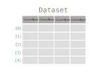

Riptable Datasets, FastArrays, and Structs
===================================================

What Is a Dataset?
------------------

A Dataset is a table of data that consists of a sequence of columns of
the same length. It’s similar to a spreadsheet, a SQL table, a Pandas
DataFrame or the data.frame in R. The Dataset is the workhorse of
Riptable.

Each column in a Dataset consists of a key (also referred to as the
column label, header, or name) and a series of values stored in a
Riptable FastArray. A FastArray is a 1-dimensional array of values that
are all the same data type, or dtype.

Though each Dataset column has a single dtype, the Dataset overall can
hold columns of various dtypes.

Dataset rows are implicitly indexed by integer. You can select rows
using their indices, but you can’t reindex rows or give them arbitrary
labels. This restriction helps Riptable perform Dataset operations more
efficiently.

Create a Dataset
----------------

Generally speaking, there are a few ways to create Riptable Datasets.
You can convert a Python dictionary or use Riptable’s dictionary-style
syntax, or create an empty Dataset and add arrays as columns.

Convert a Python Dictionary to a Riptable Dataset
~~~~~~~~~~~~~~~~~~~~~~~~~~~~~~~~~~~~~~~~~~~~~~~~~

If you have a Python dictionary, it’s easy to convert it to a Riptable
Dataset::

    >>> my_dict = {'Column1': ['A', 'B', 'C', 'D'], 'Column2': [0, 1, 2, 3]}  # Create a Python dictionary
    >>> ds = rt.Dataset(my_dict)  # Convert it to a Riptable Dataset
    >>> ds
    #   Column1   Column2
    -   -------   -------
    0   A               0
    1   B               1
    2   C               2
    3   D               3

Another way to think of a Dataset is as a dictionary of same-length
FastArrays, where each key is a column name that’s mapped to a FastArray
of values that all have the same dtype.

For Python dictionary details, see `Python’s
documentation <https://docs.python.org/3/tutorial/datastructures.html#dictionaries>`__.

Use the Dataset Constructor with Dictionary-Style Input
~~~~~~~~~~~~~~~~~~~~~~~~~~~~~~~~~~~~~~~~~~~~~~~~~~~~~~~

``rt.Dataset()`` uses dictionary-style syntax::

    >>> ds = rt.Dataset({'Column1': ['A', 'B', 'C', 'D'], 'Column2': [0.0, 1.0, 2.0, 3.0]})
    >>> ds
    #   Column1   Column2
    -   -------   -------
    0   A            0.00
    1   B            1.00
    2   C            2.00
    3   D            3.00

Create an Empty Dataset and Add Columns to It
~~~~~~~~~~~~~~~~~~~~~~~~~~~~~~~~~~~~~~~~~~~~~

You can also create an empty dataset by using ``rt.Dataset()``
without any dictionary input ... 

::

    >>> ds = rt.Dataset()

... and then add columns to it.

Add Dataset Columns (FastArrays)
~~~~~~~~~~~~~~~~~~~~~~~~~~~~~~~~

The first column you add to the Dataset can be any length, but all
future columns must match that length.

The columns you add to the Dataset become aligned, meaning that they
share the same row index.

You can add a column to a Dataset using attribute assignment or
dictionary-style syntax. Here, we use attribute assignment to create a
column named ‘Column1’ that holds a list of values::

    >>> ds.Column1 = [0.0, 1.0, 2.0, 3.0, 4.0]
    >>> ds
    #   Column1
    -   -------
    0      0.00
    1      1.00
    2      2.00
    3      3.00
    4      4.00

The list becomes a FastArray. You can use attribute access to get the
column’s data::

    >>> ds.Column1
    FastArray([0., 1., 2., 3., 4.])

Here, we use dictionary-style syntax to add a column of integers::

    >>> ds['Ints'] = [1, 2, 3, 4, 5]
    >>> ds
    #   Column1   Ints
    -   -------   ----
    0      0.00      1
    1      1.00      2
    2      2.00      3
    3      3.00      4
    4      4.00      5

And we can use dictionary-style syntax to access column data::

    >>> ds['Ints']
    FastArray([1, 2, 3, 4, 5])

A Note About Column Names
~~~~~~~~~~~~~~~~~~~~~~~~~

Column names should meet Python’s rules for well-formed variable names. If 
a column name doesn’t meet these rules (for example, if it’s a procedurally 
generated name that starts with a symbol), you can’t refer to it or get its 
data using attribute access.

For example, trying to access a column called #%&ColumnName with
``ds.#%&ColumnName`` will give you a syntax error. To access the column,
you’ll need to use dictionary-style syntax: ``ds['#%&ColumnName']``.

Python keywords and Riptable class methods are also restricted. If
you’re not sure whether a column name is valid, you can use the Dataset
method ``is_valid_colname()``.

For example, ``for`` is invalid because it’s a Python keyword::

    >>> ds.is_valid_colname('for')
    False

And ``col_move`` is invalid because it’s a Dataset class method::

    >>> ds.is_valid_colname('col_move')
    False

You can see all restricted names with ``get_restricted_names``::

    >>> # Limit and format the output.
    >>> print("Some of the restricted names include...\n")
    >>> print(", ".join(list(ds.get_restricted_names())[::10]))
    Some of the restricted names include...

    mask_or_isinf, __reduce_ex__, imatrix_xy, __weakref__, dtypes, _get_columns, from_arrow, elif, __imul__, _deleteitem, __rsub__, _index_from_row_labels, as_matrix, putmask, _as_meta_data, shape, cat, __invert__, try, _init_columns_as_dict, label_as_dict, col_str_replace, _replaceitem, label_set_names, __contains__, __floordiv__, _row_numbers, filter, __init__, sorts_on, flatten_undo, col_str_match, __dict__, size, __rand__, info, col_remove, as, or

Add a NumPy Array as a Column
~~~~~~~~~~~~~~~~~~~~~~~~~~~~~

If you have a 1-dimensional NumPy array, you can add that as a column –
it also will be converted to a FastArray::

    >>> my_np_array = np.array([5.0, 6.0, 7.5, 8.5, 9.0])
    >>> ds.NPArr = my_np_array
    >>> ds
    #   Column1   Ints   NPArr
    -   -------   ----   -----
    0      0.00      1    5.00
    1      1.00      2    6.00
    2      2.00      3    7.50
    3      3.00      4    8.50
    4      4.00      5    9.00

Warning: Although you can technically convert a 2-dimensional (or
higher) NumPy array to a multi-dimensional FastArray, multi-dimensional
FastArrays aren’t supported and you could get unexpected results when
you try to work with one::

    >>> a = np.array([[1, 2, 3, 4], [5, 6, 7, 8], [9, 10, 11, 12]])
    >>> a_fa = rt.FastArray(a)
    C:\\riptable\\rt_fastarray.py:561: UserWarning: FastArray contains two or more dimensions greater than one - shape:(3, 4).  Problems may occur.
      warnings.warn(warning_string)

If you don’t specify the dtype, Riptable makes its best guess::

    >>> ds.Ints.dtype
    dtype('int32')

If you want to specify the dtype, create a FastArray directly with the
``dtype`` parameter::

    >>> ds.Floats = rt.FastArray([0, 1, 2, 3, 4], dtype=float)
    >>> ds
    #   Column1   Ints   NPArr   Floats
    -   -------   ----   -----   ------
    0      0.00      1    5.00     0.00
    1      1.00      2    6.00     1.00
    2      2.00      3    7.50     2.00
    3      3.00      4    8.50     3.00
    4      4.00      5    9.00     4.00

Tip: You can also create a FastArray using the shortcut ``rt.FA()``.

If you add a column with a single value, the value is duplicated to fill
every existing row::

    >>> ds.Ones = 1
    >>> ds
    #   Column1   Ints   NPArr   Floats   Ones
    -   -------   ----   -----   ------   ----
    0      0.00      1    5.00     0.00      1
    1      1.00      2    6.00     1.00      1
    2      2.00      3    7.50     2.00      1
    3      3.00      4    8.50     3.00      1
    4      4.00      5    9.00     4.00      1

Instantiating a column with ones or zeros as placeholder data can be
useful – see some options in the `Instantiate with Placeholder
Values and Generate Sample Data <tutorial_sample_data.rst>`__ section.

Get Basic Info About a Dataset
------------------------------

Datasets have attributes (sometimes also called properties) that give
you information about them.

To better see how they work, let’s create a slightly larger Dataset::

    >>> rng = np.random.default_rng(seed=42)  # Construct a random number generator
    >>> ds2 = rt.Dataset()
    >>> N = 50
    >>> ds2.Symbol = rt.FA(np.random.choice(['AAPL', 'AMZN', 'TSLA', 'SPY', 'GME'], N))
    >>> ds2.Size = rt.FA(np.random.choice([100, 200, 300, 400, 500], N))
    >>> ds2.Value = rng.random(N)
    >>> ds2
    #   Symbol   Size   Value
  ---   ------   ----   -----
    0   SPY       500    0.77
    1   AMZN      500    0.44
    2   AAPL      400    0.86
    3   SPY       300    0.70
    4   TSLA      300    0.09
    5   SPY       400    0.98
    6   GME       300    0.76
    7   TSLA      500    0.79
    8   AAPL      400    0.13
    9   GME       500    0.45
   10   SPY       300    0.37
   11   SPY       400    0.93
   12   TSLA      100    0.64
   13   AMZN      100    0.82
   14   SPY       400    0.44
  ...   ...       ...     ...
   35   AMZN      400    0.19
   36   GME       200    0.13
   37   AMZN      400    0.48
   38   SPY       500    0.23
   39   TSLA      500    0.67
   40   AMZN      100    0.44
   41   AAPL      300    0.83
   42   AAPL      400    0.70
   43   AAPL      200    0.31
   44   AAPL      300    0.83
   45   TSLA      100    0.80
   46   GME       500    0.39
   47   AAPL      300    0.29
   48   AAPL      200    0.68
   49   GME       400    0.14

Use ``shape`` to get the Dataset’s dimensions returned as a tuple (rows,
cols)::

    >>> ds2.shape
    (50, 3)

See the dtypes of a Dataset (note the plural ``.dtypes`` vs. the
singular ``.dtype`` for FastArrays)::

    >>> ds2.dtypes
    {'Symbol': dtype('S4'), 'Size': dtype('int32'), 'Value': dtype('float64')}

Datasets also have methods that give you a feel for the data they
contain. Useful methods for seeing quick subsets of your Dataset are
``head()``, ``tail()``, and ``sample()``. By default, ``head()`` and
``tail()`` show you the first or last 20 rows, respectively, while
``sample()`` shows you 10 rows randomly selected from the Dataset. For
each, you can pass an argument to show a custom number of rows.

The first 5 rows::

    >>> ds2.head(5)
    #   Symbol   Size   Value
    -   ------   ----   -----
    0   SPY       500    0.77
    1   AMZN      500    0.44
    2   AAPL      400    0.86
    3   SPY       300    0.70
    4   TSLA      300    0.09

The last 10 rows::

    >>> ds2.tail(10)
    #   Symbol   Size   Value
    -   ------   ----   -----
    0   AMZN      100    0.44
    1   AAPL      300    0.83
    2   AAPL      400    0.70
    3   AAPL      200    0.31
    4   AAPL      300    0.83
    5   TSLA      100    0.80
    6   GME       500    0.39
    7   AAPL      300    0.29
    8   AAPL      200    0.68
    9   GME       400    0.14

If the first or last rows aren’t representative of your data, it can be
preferable to use ``sample``::

    >>> ds2.sample()
    #   Symbol   Size   Value
    -   ------   ----   -----
    0   GME       300    0.76
    1   SPY       400    0.44
    2   AMZN      100    0.83
    3   TSLA      400    0.76
    4   SPY       200    0.97
    5   GME       100    0.15
    6   SPY       400    0.97
    7   AMZN      500    0.37
    8   AMZN      400    0.19
    9   AAPL      200    0.68

For numerical data, ``describe()`` gives you summary statistics.
Non-numerical columns are ignored::

    >>> ds2.describe()
    *Stats     Size   Value
    ------   ------   -----
    Count     50.00   50.00
    Valid     50.00   50.00
    Nans       0.00    0.00
    Mean     302.00    0.54
    Std      142.13    0.28
    Min      100.00    0.04
    P10      100.00    0.14
    P25      200.00    0.32
    P50      300.00    0.52
    P75      400.00    0.78
    P90      500.00    0.86
    Max      500.00    0.98
    MeanM    302.38    0.54

For each numerical column, ``describe()`` provides these summary
statistics:

=============== ==============================
**Calculation** **Description**
=============== ==============================
Count           Total number of items
Valid           Total number of valid values
Nans            Total number of NaN values*
Mean            Mean
Std             Standard deviation
Min             Minimum value
P10             10th percentile
P25             25th percentile
P50             50th percentile
P75             75th percentile
P90             90th percentile
Max             Maximum value
MeanM           Mean without top or bottom 10%
=============== ==============================

\*NaN stands for Not a Number, and is commonly used to represent missing data. 
For details, see `Working with Missing Data <tutorial_missing_data.rst>`__.

You can also use ``describe()`` on a single column::

    >>> ds2.Value.describe()
    *Stats   Value
    ------   -----
    Count    50.00
    Valid    50.00
    Nans      0.00
    Mean      0.54
    Std       0.28
    Min       0.04
    P10       0.14
    P25       0.32
    P50       0.52
    P75       0.78
    P90       0.86
    Max       0.98
    MeanM     0.54

If your Dataset is very large, you can get column statistics with
``statx()``, which you can import from ``riptable.rt_stats``. 
``statx()`` provides rapid sampling and gives
you a few more percentiles than ``describe()`` does, but it works only
on one column at a time::

    >>> from riptable.rt_stats import statx
    >>> statx(ds2.Value)
             Stat      Value
    0         min   0.043804
    1        0.1%   0.044784
    2          1%   0.053610
    3         10%   0.138769
    4         25%   0.315731
    5         50%   0.515145
    6         75%   0.777277
    7         90%   0.862050
    8         99%   0.973209
    9       99.9%   0.975381
    10        max   0.975622
    11       Mean   0.535233
    12     StdDev   0.277838
    13      Count  50.000000
    14  NaN_Count   0.000000

Other Useful Dataset Methods
~~~~~~~~~~~~~~~~~~~~~~~~~~~~

See a column’s unique values::

    >>> ds2.Symbol.unique()
    FastArray([b'AAPL', b'AMZN', b'GME', b'SPY', b'TSLA'], dtype='|S4')

A note about strings in FastArrays: When you view a FastArray of
strings, you’ll see a ‘b’ next to each string. These b's indicate that the strings are encoded to byte strings,
which saves memory compared to saving strings as ASCII.

Count the number of unique values in a column::

    >>> ds2.Symbol.count()
    *Symbol   Count
    -------   -----
    AAPL         12
    AMZN         12
    GME           7
    SPY           8
    TSLA         11

Note that ``count()`` displays aggregated results. We’ll look more at
Riptable’s structures and functions for aggregations later, when we
cover Categoricals and Accums.

View the Dataset as a dictionary::

    >>> ds2.asdict()
    {'Symbol': FastArray([b'TSLA', b'SPY', b'GME', b'SPY', b'SPY', b'AAPL', b'AAPL',
            b'SPY', b'TSLA', b'AMZN', b'SPY', b'AMZN', b'AMZN', b'TSLA',
            b'GME', b'SPY', b'SPY', b'SPY', b'SPY', b'GME', b'AAPL',
            b'AAPL', b'TSLA', b'SPY', b'AMZN', b'TSLA', b'TSLA', b'AAPL',
            b'TSLA', b'SPY', b'GME', b'AAPL', b'SPY', b'AMZN', b'AAPL',
            b'AAPL', b'AMZN', b'TSLA', b'GME', b'AMZN', b'GME', b'AMZN',
            b'AAPL', b'AMZN', b'AAPL', b'AAPL', b'AMZN', b'GME', b'AAPL',
            b'AMZN'], dtype='|S4'),
     'Size': FastArray([400, 100, 100, 300, 300, 400, 300, 300, 300, 200, 500, 500,
            500, 400, 400, 100, 500, 400, 500, 200, 400, 500, 300, 200,
            200, 500, 400, 100, 500, 500, 300, 300, 200, 300, 500, 200,
            200, 500, 200, 300, 400, 200, 100, 500, 100, 400, 400, 200,
            200, 400]),
     'Value': FastArray([0.77395605, 0.43887844, 0.85859792, 0.69736803, 0.09417735,
            0.97562235, 0.7611397 , 0.78606431, 0.12811363, 0.45038594,
            0.37079802, 0.92676499, 0.64386512, 0.82276161, 0.4434142 ,
            0.22723872, 0.55458479, 0.06381726, 0.82763117, 0.6316644 ,
            0.75808774, 0.35452597, 0.97069802, 0.89312112, 0.7783835 ,
            0.19463871, 0.466721  , 0.04380377, 0.15428949, 0.68304895,
            0.74476216, 0.96750973, 0.32582536, 0.37045971, 0.46955581,
            0.18947136, 0.12992151, 0.47570493, 0.22690935, 0.66981399,
            0.43715192, 0.8326782 , 0.7002651 , 0.31236664, 0.8322598 ,
            0.80476436, 0.38747838, 0.2883281 , 0.6824955 , 0.13975248])}

Select Dataset Columns
----------------------

As mentioned above, you can access a Dataset column using attribute
access (``ds.Column1``) or using dictionary-style syntax
(``ds['Column1']``).

To select multiple columns of a Dataset, pass a list of column names to
``col_filter()``::

    >>> ds.col_filter(['Floats', 'Ones'])
    #   Floats   Ones
    -   ------   ----
    0     0.00      1
    1     1.00      1
    2     2.00      1
    3     3.00      1
    4     4.00      1

``col_filter()`` also accepts regular expressions::

    >>> ds.col_filter(regex='Col*')
    #   Column1
    -   -------
    0      0.00
    1      1.00
    2      2.00
    3      3.00
    4      4.00

For selecting subsets of columns, Riptable supports all of the indexing,
slicing, and “fancy indexing” operations supported by NumPy arrays.

Select a single value at index 0::

    >>> ds.Column1[0]
    0.0

Get a slice of contiguous values from index 1 (included) to index 4
(excluded)::

    >>> ds.Column1[1:4]
    FastArray([1., 2., 3.])

To use fancy indexing, pass an array that specifies noncontiguous
indices and your desired ordering::

    >>> ds.Floats[[1, 3, 0]]
    FastArray([1., 3., 0.])

You can also set values using indexing and slicing::

    >>> ds.Column1[0] = 5.0
    >>> ds.Ints[1:3] = 4
    >>> ds.Floats[2:4] = 10.0, 20.0
    >>> ds.Ones[[1, 3, 0]] = 2_000_000, 4_000_000, 5_000_000  # Underscores are nice for code readability!
    >>> ds
    #   Column1   Ints   NPArr   Floats      Ones
    -   -------   ----   -----   ------   -------
    0      5.00      1    5.00     0.00   5000000
    1      1.00      4    6.00     1.00   2000000
    2      2.00      4    7.50    10.00         1
    3      3.00      4    8.50    20.00   4000000
    4      4.00      5    9.00     4.00         1

Warning: Trying to insert a floating-point value into a column/FastArray
of integers will cause the floating-point value to be silently
truncated::

    >>> ds.Ones[0] = 1.5
    >>> ds
    #   Column1   Ints   NPArr   Floats      Ones
    -   -------   ----   -----   ------   -------
    0      5.00      1    5.00     0.00         1
    1      1.00      4    6.00     1.00   2000000
    2      2.00      4    7.50    10.00         1
    3      3.00      4    8.50    20.00   4000000
    4      4.00      5    9.00     4.00         1

To learn more about accessing data using indexing and slicing, see
examples for 1-dimensional NumPy ndarrays in `NumPy’s
documentation <https://numpy.org/doc/stable/user/index.html>`__.

Select Dataset Rows
-------------------

To select Dataset rows, you need to also specify which columns you want.

First row, Column1::

    >>> ds[0, 'Column1']
    5.0

You can also refer to columns by number::

    >>> ds[0, 0]
    5.0

The ``:`` specifies all columns::

    >>> ds[0:3, :]
    #   Column1   Ints   NPArr   Floats      Ones
    -   -------   ----   -----   ------   -------
    0      5.00      1    5.00     0.00         1
    1      1.00      4    6.00     1.00   2000000
    2      2.00      4    7.50    10.00         1

Or you can pass a list of multiple columns::

    >>> ds[0:2, ['Ints', 'Ones']]
    #   Ints      Ones
    -   ----   -------
    0      1         1
    1      4   2000000

More often, you’ll probably use filters to get subsets of your data. That's
covered in more detail in `Get and Operate on Subsets of Data Using
Filters <tutorial_filters.rst>`__.

Perform Operations on Dataset Columns
-------------------------------------

FastArrays are a subclass of NumPy’s ndarray. Thanks to this, you can do
anything with FastArrays that you can do with NumPy arrays.

In particular, NumPy’s universal functions (ufuncs) are supported,
allowing for fast, vectorized operations. (Vectorized functions operate
element-wise on arrays without using Python loops, which are slow.) See
the `NumPy API
Reference <https://numpy.org/doc/stable/reference/index.html>`__ for a
complete list and documentation for all NumPy methods.

Note, though, that Riptable has implemented its own optimized version of
many NumPy methods. If you call a NumPy method that’s been optimized by
Riptable, the Riptable method is called. We encourage you to call the
Riptable method directly to avoid any confusion about what method is
being called. See `NumPy Methods Optimized by
Riptable <tutorial_numpy_rt.rst>`__ for details.

If a method hasn’t been optimized by Riptable, the NumPy method is
called.

Arithmetic on Column Values
~~~~~~~~~~~~~~~~~~~~~~~~~~~

You can do various arithmetic operations on any numerical column (or
standalone FastArray) and optionally put the results into a new column.

Binary operations on two columns are performed on an element-by-element
basis. The columns must be the same length::

    >>> ds3 = rt.Dataset()
    >>> ds3.A = [0, 1, 2]
    >>> ds3.B = [5, 5, 5]
    >>> ds3.C = ds3.A + ds3.B
    >>> ds3
    #   A   B   C
    -   -   -   -
    0   0   5   5
    1   1   5   6
    2   2   5   7

FastArrays also support broadcasting, which allows you to perform a
binary operation on a FastArray and a scalar. For example, you can add a
scalar to an array.

Riptable will upcast data types as necessary to preserve information::

    >>> ds3.D = ds3.A + 5.1
    >>> ds3
    #   A   B   C      D
    -   -   -   -   ----
    0   0   5   5   5.10
    1   1   5   6   6.10
    2   2   5   7   7.10

Note that the standard order of operations is respected::

    >>> ds3.E = -(0.5*ds3.A + 1) ** 2
    >>> ds3
    #   A   B   C      D       E
    -   -   -   -   ----   -----
    0   0   5   5   5.10   -1.00
    1   1   5   6   6.10   -2.25
    2   2   5   7   7.10   -4.00

You can populate a Dataset column with the results of an operation on a
column of another Dataset, as long as the resulting FastArray is the
right length for the Dataset you want to add it to::

    >>> ds4 = rt.Dataset({'A': [10, 11, 12], 'B': [21, 22, 23]})
    >>> ds3.F = ds4.A * 2
    >>> ds3
    #   A   B   C      D       E    F
    -   -   -   -   ----   -----   --
    0   0   5   5   5.10   -1.00   20
    1   1   5   6   6.10   -2.25   22
    2   2   5   7   7.10   -4.00   24

Delete a Column from a Dataset
~~~~~~~~~~~~~~~~~~~~~~~~~~~~~~

To delete a column from a Dataset, use ``del ds.ColumnName``.

Reducing Operations vs. Non-Reducing Operations
~~~~~~~~~~~~~~~~~~~~~~~~~~~~~~~~~~~~~~~~~~~~~~~

The operations we’ve performed so far have been *non-reducing*
operations. A non-reducing operation takes in multiple input values and
returns one output value for each input value. That is, the resulting
FastArray is the same length as the FastArray you operated on, and it
can be added to the same Dataset.

A *reducing* operation, on the other hand, takes in multiple inputs and
returns one value. ``sum()`` and ``mean()`` are examples of reducing
operations. This distinction will be more important when we talk about
Categoricals and operations on grouped data. For now, we’ll get the
results of two reducing operations without adding them to a Dataset.

The total of the Size column::

    >>> ds2.Size.sum()
    15700

The average of the Value column::

    >>> ds2.Value.mean()
    0.5352327331104895

Tip: Many column operations can be called in two ways: as a method called on
a FastArray (``ds2.Size.sum()``) or as a Riptable function with the column as
the argument (``rt.sum(ds2.Size)``).

Watch Out for Missing Values
~~~~~~~~~~~~~~~~~~~~~~~~~~~~

When you’re working with real data, there will often be missing values.
Take care when performing operations! In Riptable, missing
floating-point values are represented by ``nan``. In a regular
arithmetic operation with a floating-point ``nan``, the result is
``nan``::

    >>> y = rt.FA([1.0, 2.0, 3.0, rt.nan])
    >>> y.sum()
    nan

Fortunately, many functions have “nan” versions that ignore ``nan``
values::

    >>> y.nansum()
    6.0

Useful NaN functions:

+----------------------------+-----------------------------------------+
| **Function**               | **Description** (all functions ignore   |
|                            | NaN values)                             |
+============================+=========================================+
| nanmin(), nanmax()         | Minimum and maximum                     |
+----------------------------+-----------------------------------------+
| nanvar()                   | Variance                                |
+----------------------------+-----------------------------------------+
| nanmean()                  | Mean                                    |
+----------------------------+-----------------------------------------+
| nanstd()                   | Standard deviation                      |
+----------------------------+-----------------------------------------+
| nansum()                   | Total of all items                      |
+----------------------------+-----------------------------------------+
| nanargmin(), nanargmax()   | Index of the minimum or maximum value   |
+----------------------------+-----------------------------------------+
| rollingnansum(),           | Rolling sum, rolling mean               |
| rollingnanmean()           |                                         |
+----------------------------+-----------------------------------------+

Another way to deal with NaN values is to replace them with other
values. For details, see `Working with Missing
Data <tutorial_missing_data.rst>`__.

Sort Column Values
~~~~~~~~~~~~~~~~~~

Sorting a column is straightforward. Use ``sort_copy()`` to return a
sorted version of the array without modifying the original input, or
``sort_inplace()`` if you’re OK with modifying the original data::

    >>> ds4 = rt.Dataset()
    >>> ds4.A = rng.choice(['AAPL', 'AMZN', 'TSLA', 'SPY', 'GME'], 10)
    >>> ds4.B = rng.integers(low=0, high=5, size=10)
    >>> ds4.C = rng.random(10)
    >>> ds4
    #   A      B      C
    -   ----   -   ----
    0   GME    1   0.67
    1   AAPL   3   0.47
    2   GME    2   0.57
    3   AAPL   2   0.76
    4   SPY    2   0.63
    5   SPY    2   0.55
    6   SPY    0   0.56
    7   SPY    0   0.30
    8   TSLA   1   0.03
    9   SPY    0   0.44

You can sort by one column::

    >>> ds4.sort_copy('A')
    #   A      B      C
    -   ----   -   ----
    0   AAPL   2   0.76
    1   AAPL   3   0.47
    2   GME    1   0.67
    3   GME    2   0.57
    4   SPY    0   0.56
    5   SPY    0   0.30
    6   SPY    0   0.44
    7   SPY    2   0.63
    8   SPY    2   0.55
    9   TSLA   1   0.03

Or by more than one column by passing an ordered list::

    >>> ds4.sort_copy(['A', 'B'])
    #   A      B      C
    -   ----   -   ----
    0   AAPL   2   0.76
    1   AAPL   3   0.47
    2   GME    1   0.67
    3   GME    2   0.57
    4   SPY    0   0.56
    5   SPY    0   0.30
    6   SPY    0   0.44
    7   SPY    2   0.63
    8   SPY    2   0.55
    9   TSLA   1   0.03

With ``sort_copy()``, the original Dataset is not modified::

    >>> ds4
    #   A      B      C
    -   ----   -   ----
    0   SPY    0   0.56
    1   SPY    0   0.30
    2   SPY    0   0.44
    3   GME    1   0.67
    4   TSLA   1   0.03
    5   GME    2   0.57
    6   AAPL   2   0.76
    7   SPY    2   0.63
    8   SPY    2   0.55
    9   AAPL   3   0.47

Use ``sort_inplace()`` if you want to modify the original input (for
example, if your data needs to be sorted by time, but isn’t)::

    >>> ds4.sort_inplace('B')
    #   A      B      C
    -   ----   -   ----
    0   SPY    0   0.56
    1   SPY    0   0.30
    2   SPY    0   0.44
    3   GME    1   0.67
    4   TSLA   1   0.03
    5   GME    2   0.57
    6   AAPL   2   0.76
    7   SPY    2   0.63
    8   SPY    2   0.55
    9   AAPL   3   0.47

Change the sort order by passing ``ascending=False``::

    >>> ds4.sort_copy('A', ascending=False)
    #   A      B      C
    -   ----   -   ----
    0   TSLA   1   0.03
    1   SPY    2   0.55
    2   SPY    2   0.63
    3   SPY    0   0.44
    4   SPY    0   0.30
    5   SPY    0   0.56
    6   GME    2   0.57
    7   GME    1   0.67
    8   AAPL   3   0.47
    9   AAPL   2   0.76

Split Data into New Columns Using String Operations
~~~~~~~~~~~~~~~~~~~~~~~~~~~~~~~~~~~~~~~~~~~~~~~~~~~

Sometimes related pieces of data come bundled together in a single
string, and you want to break up the data into separate columns.

For example, take a look at the OSI Symbol field commonly found in
trading-related data. OSIs are the official name for a tradable option.
They contain several pieces of information that are separated by colons.

For example, in **AAPL:191018:260:0:C**:

-  AAPL is the underlying symbol
-  191018 represents an expiration date of 2019-10-18
-  260 is the strike price dollar amount
-  The 0 is the strike price penny amount

   -  Other possibilities: :0: for 0.00, :5: for 0.50, :3: for 0.30,
      :25: for 0.25, :15: for 0.15

-  “C” indicates a call (“P” indicates a put)

Here’s what OSI Symbols might look like in a Dataset. We’ll use
``str.extract()`` to break them into separate columns::

    >>> ds5 = rt.Dataset(
    ...     {'OSISymbol':['SPY:191003:187:0:C','SPY:191003:193:0:C','TLT:191003:135:5:P', 
    ...                   'AAPL:191018:260:0:C', 'AAPL:191018:265:0:P'],
    ...                   'Delta':[.93, .71, -.72, .45, -.81],  
    ...                   'PnL':[1.03, 0.61, 0.52, -0.14, .68]
    ...     })
    >>> ds5
    #   OSISymbol         Delta     PnL
    -   ---------------   -----   -----
    0   SPY:191003:187:    0.93    1.03
    1   SPY:191003:193:    0.71    0.61
    2   TLT:191003:135:   -0.72    0.52
    3   AAPL:191018:260    0.45   -0.14
    4   AAPL:191018:265   -0.81    0.68

``str.extract()`` uses regular expressions to match patterns and
capture/extract the subpatterns that are surrounded by parentheses. Each
captured subpattern is returned in a separate column.

Below, we define five capture groups that correspond to five returned
columns of data. Inside the capture groups, we match any letters or
numbers::

    >>> ds5[['Symbol', 'Expiration', 'StrikeDollar', 'StrikePenny', 
    ...      'PutCall']] = ds5.OSISymbol.str.extract('(.*):(.*):(.*):(.*):(.*)', 
    ...      names=['Symbol', 'Expiration', 'StrikeDollar', 'StrikePenny', 'PutCall'])
    >>> ds5
    #   OSISymbol         Delta     PnL   Symbol   Expiration   StrikeDollar   StrikePenny   PutCall
    -   ---------------   -----   -----   ------   ----------   ------------   -----------   -------
    0   SPY:191003:187:    0.93    1.03   SPY      191003       187            0             C      
    1   SPY:191003:193:    0.71    0.61   SPY      191003       193            0             C      
    2   TLT:191003:135:   -0.72    0.52   TLT      191003       135            5             P      
    3   AAPL:191018:260    0.45   -0.14   AAPL     191018       260            0             C      
    4   AAPL:191018:265   -0.81    0.68   AAPL     191018       265            0             P    

It’s not ideal to have the strike dollar and strike penny amounts in
separate columns, so we’ll add a fix::

    >>> ds5.Strike = (ds5.StrikeDollar + '.' + ds5.StrikePenny).astype('float')
    >>> del ds5.StrikeDollar
    >>> del ds5.StrikePenny
    >>> ds5
    #   OSISymbol         Delta     PnL   Symbol   Expiration   PutCall   Strike
    -   ---------------   -----   -----   ------   ----------   -------   ------
    0   SPY:191003:187:    0.93    1.03   SPY      191003       C         187.00
    1   SPY:191003:193:    0.71    0.61   SPY      191003       C         193.00
    2   TLT:191003:135:   -0.72    0.52   TLT      191003       P         135.50
    3   AAPL:191018:260    0.45   -0.14   AAPL     191018       C         260.00
    4   AAPL:191018:265   -0.81    0.68   AAPL     191018       P         265.00

Hold Two or More Datasets in a Struct
-------------------------------------

When you’re working with multiple Datasets, it can be helpful to keep
them together in a Riptable Struct. Structs were created as a base class
for Datasets. They also replicate Matlab structs.

You can think of a Struct as a Python dictionary, but with attribute
access allowed for keys.

Data structures stored together in a Struct don’t need to be aligned::

    >>> s = rt.Struct()
    >>> s.ds = ds
    >>> s.ds2 = ds2

You can access each data structure using attribute-style access. For
example:

    >>> s.ds2
      #   Symbol   Size   Value
    ---   ------   ----   -----
      0   AAPL      300    0.77
      1   AMZN      100    0.44
      2   AAPL      300    0.86
      3   GME       500    0.70
      4   SPY       100    0.09
      5   AMZN      300    0.98
      6   TSLA      200    0.76
      7   SPY       300    0.79
      8   TSLA      300    0.13
      9   TSLA      300    0.45
     10   AAPL      400    0.37
     11   AAPL      400    0.93
     12   AAPL      400    0.64
     13   GME       100    0.82
     14   AMZN      100    0.44
    ...   ...       ...     ...
     35   GME       200    0.19
     36   TSLA      400    0.13
     37   SPY       200    0.48
     38   AMZN      500    0.23
     39   GME       400    0.67
     40   AAPL      300    0.44
     41   SPY       100    0.83
     42   TSLA      500    0.70
     43   AAPL      500    0.31
     44   AAPL      100    0.83
     45   AAPL      200    0.80
     46   AMZN      400    0.39
     47   AMZN      500    0.29
     48   AMZN      300    0.68
     49   AMZN      400    0.14

Riptable has a few other methods for operating on strings. We'll use them as
the basis for filtering data in the next section, `Get and Operate on Subsets 
of Data Using Filters <tutorial_filters.rst>`__.

--------------

Questions or comments about this guide? Email
RiptableDocumentation@sig.com.
