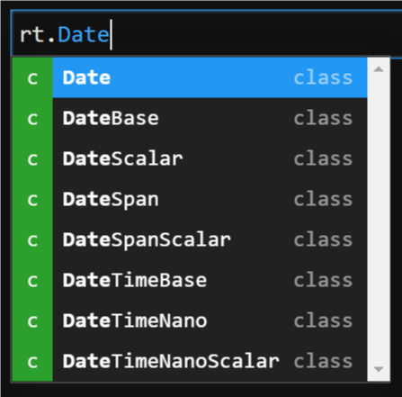
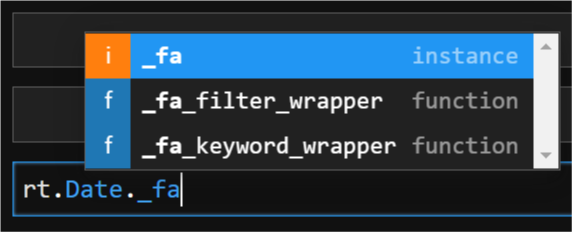

Introduction
============

What Is Riptable?
-----------------

Riptable is an open source library built for high-performance data
analysis. It’s similar to Pandas by design, but it’s been optimized to
meet the needs of Riptable’s core users: quantitative traders analyzing
large volumes of trading data interactively, in real time.

Riptable is based on NumPy, so it shares many core NumPy methods for
array-based operations. Riptable has also implemented its own Pandas-like 
functions for grouping and aggregation. For users who work with large datasets, 
Riptable improves on NumPy and Pandas by using multi-threading and efficient 
memory management, much of it implemented at the C++ level.

Riptable’s APIs are designed to be more feature-rich and easier to work
with than those provided by Pandas and other existing libraries. 

NumPy and Pandas users will find it easy to convert their data to
Riptable (and back again if need be). It’s also possible to convert data
from CSV or SQL files. Similarly, h5 files can be converted to
Riptable’s format. Matlab users, who will generally find similar syntax
and functionality in Riptable, can use special keyword arguments to
convert Matlab data to Riptable’s format. See `Work with Riptable Files and Other File Formats <tutorial_io.rst>`__ for details.

For data visualization, any of the standard plotting tools (for example,
matplotlib.pyplot) will work out of the box. To see a few basic
examples, check out the `Visualize Data <tutorial_visualize.rst>`__
section.

Who This Tutorial Is For
------------------------

If you’re new to Riptable, this tutorial is for you. It’s intended to
help get you familiar with Riptable’s basic functionality and syntax.

Some experience with Python will be helpful, especially familiarity with
dictionary syntax, sequences (lists, tuples, etc.), and basic functions
and arguments.

A Note to Pandas Users
----------------------

If you’ve used Pandas, you’ll notice many similarities in Riptable –
though be aware that Riptable has some not-always-immediately-obvious
differences. This tutorial doesn’t call out those differences
specifically; see the API Reference for details of differences in specific 
methods, functions, attributes, etc.

Install and Import Riptable
---------------------------

To install Riptable on Windows or Linux, create a Conda environment and type::

    conda install riptable

To access Riptable and its functions in your Python code, add these
lines to your code::

    import riptable as rt
    import numpy as np

Display Options
---------------

You can modify Riptable’s default display options using the attributes
offered in
`rt.Display.options <https://github.com/rtosholdings/riptable/blob/master/riptable/Utils/display_options.py>`__.
Here are a few you might find useful.

General Display Options
~~~~~~~~~~~~~~~~~~~~~~~

Some general options you can set for a session::

    # Display all Dataset columns -- the default max is 9.
    rt.Display.options.COL_ALL = True
    
    # Render up to 100MM before showing in scientific notation.
    rt.Display.options.E_MAX = 100_000_000
    
    # Truncate small decimals, rather than showing infinitesimal scientific notation.
    rt.Display.options.P_THRESHOLD = 0
    
    # Put commas in numbers.
    rt.Display.options.NUMBER_SEPARATOR = True
    
    # Turn on Riptable autocomplete (start typing, then press Tab to see options).
    rt.autocomplete()

Contextual Help
~~~~~~~~~~~~~~~

The ``rt.autocomplete()`` option listed above can be used as an
alternative to Python’s built-in ``dir()`` function, which shows various
attributes and methods associated with an object.

For example, to see the attributes and methods of Riptable’s Date
object, you can use ``dir()``::

    >>> # Limit and format the output.
    >>> dir_date = dir(rt.Date)
    >>> print("Some of the attributes and methods include...\n")
    >>> print(", ".join(list(dir_date)[::10]))
    Some of the attributes and methods include...

    CompressPickle, T, _LDUMP, _TON, __array_function__, __class__, __doc__, __hash__, __init_subclass__, __le__, __new__, __rfloordiv__, __rsub__, __truediv__, _check_mathops, _fa_keyword_wrapper, _max, _nanstd, _reduce_op_identity_value, _yearday_splits_leap, argpartition, clip_upper, cummin, differs, ema_decay, format_date_num, is_leapyear, isnormal, map_old, move_mean, nanmean, nonzero, push, reshape, round, sign, strides, tolist, year
    

Note: The resulting list may not be complete. For details, see Python’s
documentation for ``dir()`` in the section on built-in functions.

Alternatively, you can use Riptable’s autocomplete interface. With
``rt.autocomplete()`` turned on, type ``rt.Date.<TAB>`` where ``<TAB>``
is the Tab key. You’ll see a pop-up list of attributes and methods. Keep
typing to narrow down the list.

Note that private/internal attributes and methods (those whose names are
preceded by an underscore) are omitted by default, but you can access
them by typing the underscore. For example: ``rt.Date._fa<TAB>``.

You can access the doc string on any (documented) function or object
with the following syntax:

-  IPython prompt: ``my_func?``
-  Python prompt: ``help(my_obj)``

For example::

    >>> rt.sum?
    Signature: rt.sum(*args, filter=None, dtype=None, **kwargs)
    Docstring:
    Compute the sum of the values in the first argument. 

    When possible, ``rt.sum(x, *args)`` calls ``x.sum(*args)``; look there for
    documentation. In particular, note whether the called function accepts the
    keyword arguments listed below. For example, `Dataset.sum()` does not accept
    the `filter` or `dtype` keyword arguments.

    For ``FastArray.sum``, see `numpy.sum` for documentation but note the following:

    * The `dtype` keyword argument may not work as expected:

        * Riptable data types (for example, `rt.float64`) are ignored. 
        * NumPy integer data types (for example, `numpy.int32`) are also ignored. 
        * NumPy floating point data types are applied as `numpy.float64`.

    * If you include another NumPy parameter (for example, ``axis=0``), the NumPy
    implementation of ``sum`` will be used and the ``dtype`` will be used to 
    compute the sum.
        
    Parameters
    ----------
    filter : array of bool, default None
        Specifies which elements to include in the sum calculation.          
    dtype : rt.dtype or numpy.dtype, optional
        The data type of the result. By default, for integer input the result `dtype` is 
        ``int64`` and for floating point input the result `dtype` is ``float64``. See 
        the notes above about using this keyword argument with `FastArray` objects 
        as input.
        
    See Also
    --------
    numpy.sum
    nansum : Sums the values, ignoring NaNs.
    FastArray.sum : Sums the values of a `FastArray`.
    Dataset.sum : Sums the values of numerical `Dataset` columns.
    GroupByOps.sum : Sums the values of each group. Used by `Categorical` objects.
            
    Examples
    --------
    >>> a = rt.FastArray([1, 3, 5, 7])
    >>> rt.sum(a)
    16

    >>> a = rt.FastArray([1.0, 3.0, 5.0, 7.0])
    >>> rt.sum(a)
    16.0
    File:      c:\\riptable\\rt_numpy.py
    Type:      function

You can access the source code with ``??``::

    >>> rt.sum??
    Signature: rt.sum(*args, filter=None, dtype=None, **kwargs)
    Docstring:
    Compute the sum of the values in the first argument. 

    When possible, ``rt.sum(x, *args)`` calls ``x.sum(*args)``; look there for
    documentation. In particular, note whether the called function accepts the
    keyword arguments listed below. For example, `Dataset.sum()` does not accept
    the `filter` or `dtype` keyword arguments.

    For ``FastArray.sum``, see `numpy.sum` for documentation but note the following:

    * The `dtype` keyword argument may not work as expected:

        * Riptable data types (for example, `rt.float64`) are ignored. 
        * NumPy integer data types (for example, `numpy.int32`) are also ignored. 
        * NumPy floating point data types are applied as `numpy.float64`.

    * If you include another NumPy parameter (for example, ``axis=0``), the NumPy
    implementation of ``sum`` will be used and the ``dtype`` will be used to 
    compute the sum.
        
    Parameters
    ----------
    filter : array of bool, default None
        Specifies which elements to include in the sum calculation.          
    dtype : rt.dtype or numpy.dtype, optional
        The data type of the result. By default, for integer input the result `dtype` is 
        ``int64`` and for floating point input the result `dtype` is ``float64``. See 
        the notes above about using this keyword argument with `FastArray` objects 
        as input.
        
    See Also
    --------
    numpy.sum
    nansum : Sums the values, ignoring NaNs.
    FastArray.sum : Sums the values of a `FastArray`.
    Dataset.sum : Sums the values of numerical `Dataset` columns.
    GroupByOps.sum : Sums the values of each group. Used by `Categorical` objects.
            
    Examples
    --------
    >>> a = rt.FastArray([1, 3, 5, 7])
    >>> rt.sum(a)
    16

    >>> a = rt.FastArray([1.0, 3.0, 5.0, 7.0])
    >>> rt.sum(a)
    16.0
    Source:   
    def sum(*args,filter = None, dtype = None,**kwargs):
        '''
        Compute the sum of the values in the first argument. 

        When possible, ``rt.sum(x, *args)`` calls ``x.sum(*args)``; look there for
        documentation. In particular, note whether the called function accepts the
        keyword arguments listed below. For example, `Dataset.sum()` does not accept
        the `filter` or `dtype` keyword arguments.
        
        For ``FastArray.sum``, see `numpy.sum` for documentation but note the following:
        
        * The `dtype` keyword argument may not work as expected:
        
            * Riptable data types (for example, `rt.float64`) are ignored. 
            * NumPy integer data types (for example, `numpy.int32`) are also ignored. 
            * NumPy floating point data types are applied as `numpy.float64`.
        
        * If you include another NumPy parameter (for example, ``axis=0``), the NumPy
        implementation of ``sum`` will be used and the ``dtype`` will be used to 
        compute the sum.
            
        Parameters
        ----------
        filter : array of bool, default None
            Specifies which elements to include in the sum calculation.          
        dtype : rt.dtype or numpy.dtype, optional
            The data type of the result. By default, for integer input the result `dtype` is 
            ``int64`` and for floating point input the result `dtype` is ``float64``. See 
            the notes above about using this keyword argument with `FastArray` objects 
            as input.
            
        See Also
        --------
        numpy.sum
        nansum : Sums the values, ignoring NaNs.
        FastArray.sum : Sums the values of a `FastArray`.
        Dataset.sum : Sums the values of numerical `Dataset` columns.
        GroupByOps.sum : Sums the values of each group. Used by `Categorical` objects.
                
        Examples
        --------
        >>> a = rt.FastArray([1, 3, 5, 7])
        >>> rt.sum(a)
        16
        
        >>> a = rt.FastArray([1.0, 3.0, 5.0, 7.0])
        >>> rt.sum(a)
        16.0
        '''
        kwargs = _np_keyword_wrapper(filter=filter, dtype=dtype, **kwargs)
        args = _convert_cat_args(args)
        if hasattr(args[0], 'sum'):
            return args[0].sum(*args[1:], **kwargs)
        return builtins.sum(*args,**kwargs)
    File:      c:\\riptable\\rt_numpy.py
    Type:      function

Dataset Display Options
~~~~~~~~~~~~~~~~~~~~~~~

When you view a Dataset, some data might be elided or truncated. By
default:

-  Up to 9 columns are shown. If the Dataset has more than 9 columns,
   the middle columns are elided (with a “…” column displayed).
-  Up to 30 rows are shown. If the Dataset has more than 30 rows, the
   middle rows are elided (with a “…” row displayed).
-  Strings are displayed up to 15 characters, with additional characters
   truncated.

The following internal/private methods override the defaults on a
per-display basis:

-  Show all columns and rows (up to 10,000 rows), as well as long
   strings: ``ds._A``
-  Show all columns and long strings: ``ds._H``
-  Show all columns with wrapping, and long strings: ``ds._G``
-  Show all rows (up to 10,000): ``ds._V``
-  Transpose columns and rows: ``ds._T``

Now that we’re all set up, we’re ready to look at Riptable’s
foundational data structures: `Riptable Datasets, FastArrays,
and Structs <tutorial_datasets.rst>`__.

--------------

Questions or comments about this guide? Email
RiptableDocumentation@sig.com.
