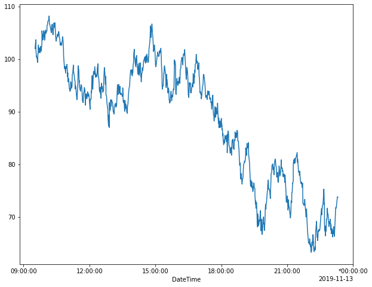
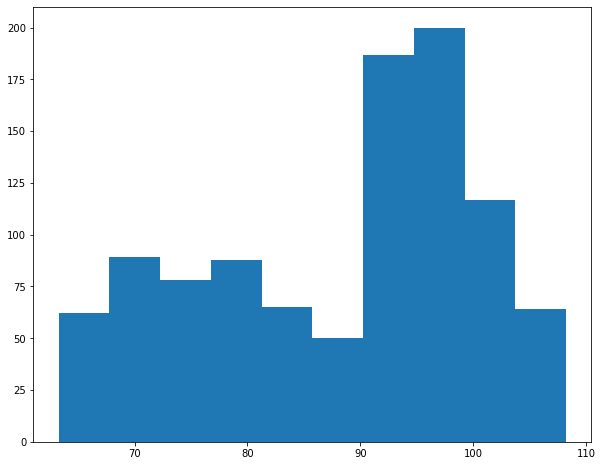
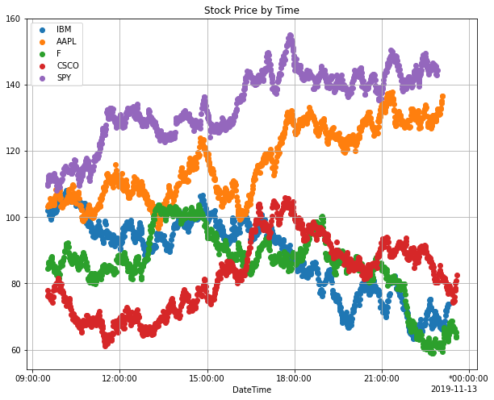
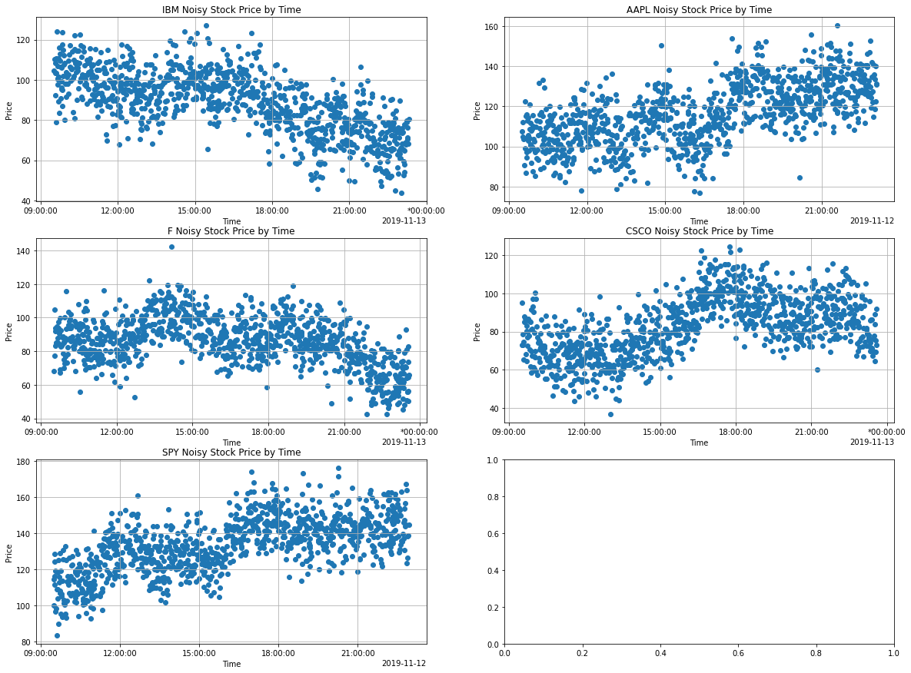
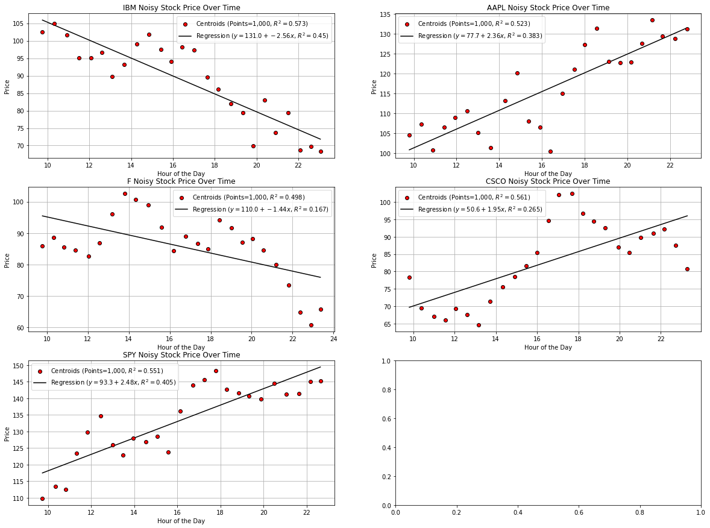

Visualize Data
==============

Riptable can work with any of the standard plotting tools, including
Matplotlib, to create visualizations of your data. You can also take
advantage of the plotting and HTML styling tools offered by Pandas.

In this section we’ll look at a couple of simple examples using
Matplotlib, Pandas, and Playa.

::

    import pandas as pd
    import matplotlib.pyplot as plt

We’ll use this Dataset in examples::

    >>> rng = np.random.default_rng(seed=42)
    >>> N = 1_000
    >>> symbols = ['IBM', 'AAPL', 'F', 'CSCO', 'SPY']
    >>> start_time = rt.DateTimeNano('20191112 09:30:00', from_tz='NYC')
    >>> ds_list = []
    >>> for symbol in symbols:
    ...     temp_ds = rt.Dataset({'Symbol': rt.full(N, symbol),
    ...                      'Price': 100.0 + 10 * rng.standard_normal(1) + rng.standard_normal(N).cumsum(),
    ...                      'Size': rng.integers(1, 50, 1) + rng.integers(1, 50, N),
    ...                      'Time': start_time + rt.TimeSpan(rng.integers(1, 100, N).cumsum(), 's'),
    ...                     })
    ...     ds_list.append(temp_ds)
    >>> ds = rt.hstack(ds_list)
    >>> ds = ds.sort_inplace('Time')
    >>> ds.sample()
    #   Symbol    Price   Size                          Time
    -   ------   ------   ----   ---------------------------
    0   SPY      114.70     36   20191112 10:53:02.000000000
    1   CSCO      88.83     74   20191112 16:24:38.000000000
    2   SPY      140.37     66   20191112 16:42:23.000000000
    3   SPY      147.62     53   20191112 17:40:02.000000000
    4   AAPL     125.24     68   20191112 18:02:39.000000000
    5   SPY      141.60     67   20191112 18:19:48.000000000
    6   SPY      139.88     61   20191112 18:41:54.000000000
    7   SPY      139.81     69   20191112 19:32:47.000000000
    8   SPY      143.03     50   20191112 20:40:38.000000000
    9   AAPL     130.09     87   20191112 22:22:09.000000000

Matplotlib Plotting
-------------------

Example of a basic plot of IBM’s share price::

    >>> f = ds.Symbol=='IBM'
    >>> plt.figure(figsize=(10,8))
    >>> plt.plot(ds.Time[f], ds.Price[f])
    >>> plt.show()

And a histogram::

    >>> plt.figure(figsize=(10,8))
    >>> plt.hist(ds.Price[f])
    >>> plt.show()

And a scatter plot::

    >>> plt.figure(figsize=(10,8))
    >>> for symbol in symbols:
    ...     f = ds.Symbol==symbol
    ...     plt.scatter(ds.Time[f], ds.Price[f], label=symbol)
    >>> plt.grid()
    >>> plt.legend()
    >>> plt.title('Stock Price by Time')
    >>> plt.show()

Pandas HTML Styling
-------------------

If you want to use the Pandas Styler methods, call ``to_pandas()`` on
your Dataset for the rendering::

    >>> def color_smaller_red(val):
    ...     color = 'red' if type(val)==float and val < 100 else 'gray'
    ...     return 'color: %s' % color
    >>> ds.to_pandas().head(10).style.applymap(color_smaller_red)

.. raw:: html

    
    <table id="T_7a35f_">
      <thead>
        <tr>
          <th class="blank level0" >&nbsp;</th>
          <th class="col_heading level0 col0" td style="text-align:right">Symbol</th>
          <th class="col_heading level0 col1" td style="text-align:right">Price</th>
          <th class="col_heading level0 col2" td style="text-align:right">Size</th>
          <th class="col_heading level0 col3" td style="text-align:right">Time</th>
        </tr>
      </thead>
      <tbody>
        <tr>
          <th id="T_7a35f_level0_row0" class="row_heading level0 row0" >0</th>
          <td id="T_7a35f_row0_col0" class="data row0 col0" td style="text-align:right">AAPL</td>
          <td id="T_7a35f_row0_col1" class="data row0 col1" td style="text-align:right">103.281775</td>
          <td id="T_7a35f_row0_col2" class="data row0 col2" td style="text-align:right">63</td>
          <td id="T_7a35f_row0_col3" class="data row0 col3" td style="text-align:right">2019-11-12 09:30:30-05:00</td>
        </tr>
        <tr>
          <th id="T_7a35f_level0_row1" class="row_heading level0 row1" >1</th>
          <td id="T_7a35f_row1_col0" class="data row1 col0" td style="text-align:right">SPY</td>
          <td id="T_7a35f_row1_col1" class="data row1 col1" td style="text-align:right">110.168266</td>
          <td id="T_7a35f_row1_col2" class="data row1 col2" td style="text-align:right">35</td>
          <td id="T_7a35f_row1_col3" class="data row1 col3" td style="text-align:right">2019-11-12 09:30:43-05:00</td>
        </tr>
        <tr>
          <th id="T_7a35f_level0_row2" class="row_heading level0 row2" >2</th>
          <td id="T_7a35f_row2_col0" class="data row2 col0" td style="text-align:right">SPY</td>
          <td id="T_7a35f_row2_col1" class="data row2 col1" td style="text-align:right">109.627368</td>
          <td id="T_7a35f_row2_col2" class="data row2 col2" td style="text-align:right">37</td>
          <td id="T_7a35f_row2_col3" class="data row2 col3" td style="text-align:right">2019-11-12 09:30:46-05:00</td>
        </tr>
        <tr>
          <th id="T_7a35f_level0_row3" class="row_heading level0 row3" >3</th>
          <td id="T_7a35f_row3_col0" class="data row3 col0" td style="text-align:right">F</td>
          <td id="T_7a35f_row3_col1" class="data row3 col1" td style="text-align:right">84.582351</td>
          <td id="T_7a35f_row3_col2" class="data row3 col2" td style="text-align:right">58</td>
          <td id="T_7a35f_row3_col3" class="data row3 col3" td style="text-align:right">2019-11-12 09:30:58-05:00</td>
        </tr>
        <tr>
          <th id="T_7a35f_level0_row4" class="row_heading level0 row4" >4</th>
          <td id="T_7a35f_row4_col0" class="data row4 col0" td style="text-align:right">IBM</td>
          <td id="T_7a35f_row4_col1" class="data row4 col1" td style="text-align:right">102.007187</td>
          <td id="T_7a35f_row4_col2" class="data row4 col2" td style="text-align:right">37</td>
          <td id="T_7a35f_row4_col3" class="data row4 col3" td style="text-align:right">2019-11-12 09:31:18-05:00</td>
        </tr>
        <tr>
          <th id="T_7a35f_level0_row5" class="row_heading level0 row5" >5</th>
          <td id="T_7a35f_row5_col0" class="data row5 col0" td style="text-align:right">CSCO</td>
          <td id="T_7a35f_row5_col1" class="data row5 col1" td style="text-align:right">77.963601</td>
          <td id="T_7a35f_row5_col2" class="data row5 col2" td style="text-align:right">73</td>
          <td id="T_7a35f_row5_col3" class="data row5 col3" td style="text-align:right">2019-11-12 09:31:35-05:00</td>
        </tr>
        <tr>
          <th id="T_7a35f_level0_row6" class="row_heading level0 row6" >6</th>
          <td id="T_7a35f_row6_col0" class="data row6 col0" td style="text-align:right">SPY</td>
          <td id="T_7a35f_row6_col1" class="data row6 col1" td style="text-align:right">109.972200</td>
          <td id="T_7a35f_row6_col2" class="data row6 col2" td style="text-align:right">46</td>
          <td id="T_7a35f_row6_col3" class="data row6 col3" td style="text-align:right">2019-11-12 09:31:36-05:00</td>
        </tr>
        <tr>
          <th id="T_7a35f_level0_row7" class="row_heading level0 row7" >7</th>
          <td id="T_7a35f_row7_col0" class="data row7 col0" td style="text-align:right">CSCO</td>
          <td id="T_7a35f_row7_col1" class="data row7 col1" td style="text-align:right">76.155438</td>
          <td id="T_7a35f_row7_col2" class="data row7 col2" td style="text-align:right">73</td>
          <td id="T_7a35f_row7_col3" class="data row7 col3" td style="text-align:right">2019-11-12 09:31:40-05:00</td>
        </tr>
        <tr>
          <th id="T_7a35f_level0_row8" class="row_heading level0 row8" >8</th>
          <td id="T_7a35f_row8_col0" class="data row8 col0" td style="text-align:right">F</td>
          <td id="T_7a35f_row8_col1" class="data row8 col1" td style="text-align:right">84.816947</td>
          <td id="T_7a35f_row8_col2" class="data row8 col2" td style="text-align:right">64</td>
          <td id="T_7a35f_row8_col3" class="data row8 col3" td style="text-align:right">2019-11-12 09:31:55-05:00</td>
        </tr>
        <tr>
          <th id="T_7a35f_level0_row9" class="row_heading level0 row9" >9</th>
          <td id="T_7a35f_row9_col0" class="data row9 col0" td style="text-align:right">F</td>
          <td id="T_7a35f_row9_col1" class="data row9 col1" td style="text-align:right">86.517740</td>
          <td id="T_7a35f_row9_col2" class="data row9 col2" td style="text-align:right">59</td>
          <td id="T_7a35f_row9_col3" class="data row9 col3" td style="text-align:right">2019-11-12 09:31:56-05:00</td>
        </tr>
      </tbody>
    </table>
    
Groupscatter Plots with Playa
-----------------------------

Playa’s ``GroupScatter()`` method groups data into buckets based on
x-values and returns a Matplotlib plot summarizing the data.

::

    from playa.plot import GroupScatter

Make a noisier price signal
^^^^^^^^^^^^^^^^^^^^^^^^^^^

::

    >>> ds.NoisyPrice = ds.Price + rng.normal(0, 10, ds.shape[0])

A regular Matplotlib scatter plot, for comparison
^^^^^^^^^^^^^^^^^^^^^^^^^^^^^^^^^^^^^^^^^^^^^^^^^

::

    >>> num_rows = int(rt.ceil(len(symbols)/2))
    >>> fig, axes = plt.subplots(num_rows, 2, figsize=(20, 5 * num_rows))
    >>> for (ax, symbol) in zip(axes.flatten(), symbols):
    ...     f = ds.Symbol==symbol
    ...     ax.scatter(ds.Time[f], ds.NoisyPrice[f])
    ...     ax.grid()
    ...     ax.set_xlabel('Time')
    ...     ax.set_ylabel('Price')
    ...     ax.set_title(f'{symbol} Noisy Stock Price by Time')
    >>> plt.show()

Now a GroupScatter for each one, you can see how it clarifies the point cloud and reveals the shape.
^^^^^^^^^^^^^^^^^^^^^^^^^^^^^^^^^^^^^^^^^^^^^^^^^^^^^^^^^^^^^^^^^^^^^^^^^^^^^^^^^^^^^^^^^^^^^^^^^^^^

::

    >>> fig, axes = plt.subplots(num_rows, 2, figsize=(20, 5 * num_rows))
    >>> for (ax, symbol) in zip(axes.flatten(), symbols):
    ...     f = ds.Symbol==symbol
    ...     gs = GroupScatter(ds.Time[f].hour, ds.NoisyPrice[f])
    ...     gs.plot(title=f'{symbol} Noisy Stock Price Over Time', x_label='Hour of the Day', y_label='Price', ax=ax)
    >>> plt.show()

This was just a brief introduction – check out the Matpotlib, Pandas,
and Playa documentation for more details and possibilities.

Next we cover useful tools for working with ``NaN``\ s and other missing
values: `Working with Missing Data <tutorial_missing_data.rst>`__.

--------------

Questions or comments about this guide? Email
RiptableDocumentation@sig.com.
